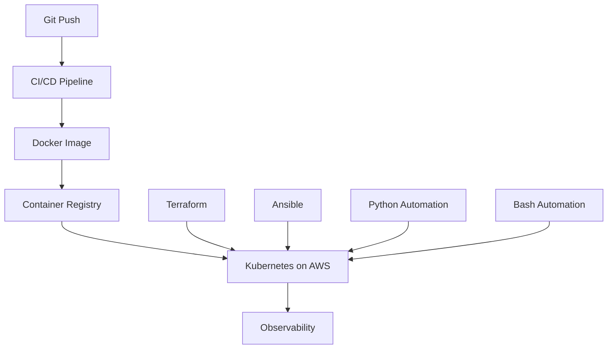

# DevOps and SRE Interview Preparation — Master Roadmap

**Prepared for:** Muhammad Khalid Khan  
**Project goal:** Become interview-ready through concept review, hands-on practice, troubleshooting, scenario questions, and mock interviews.

---

## 1. Primary Focus Areas

The red-marked topics are the project's required interview tracks:

1. Linux
2. Bash Scripting
3. Docker
4. Kubernetes
5. CI/CD
6. Terraform
7. Ansible
8. Cloud Services (AWS-first)
9. Python for automation
10. Networking and Advanced Networking
11. Observability

### Supporting Topics

- Nginx and reverse proxy
- Git and GitHub
- Security fundamentals
- System design for DevOps/SRE
- Incident response and root-cause analysis

---

## 2. Interview-Ready Standard

A topic is not complete until you can:

- Explain **what it is**, **why it is needed**, and **how it works**.
- Draw its architecture or workflow.
- Perform a hands-on task without copying every command.
- Troubleshoot at least three realistic failures.
- Answer beginner, intermediate, advanced, and scenario-based questions.
- Describe a real project in which the technology was used.
- Explain security, reliability, monitoring, and cost considerations.

---

## 3. Recommended 13-Week Learning Order

| Week | Main Track | Core Outcomes | Practical Deliverable |
|---:|---|---|---|
| 1 | Linux fundamentals | Filesystem, users, permissions, processes, services, packages | Linux administration lab |
| 2 | Linux troubleshooting | CPU, memory, disk, networking, logs, systemd, performance | Server-is-slow runbook |
| 3 | Bash scripting | Variables, input, tests, loops, functions, error handling, automation | Production-style administration script |
| 4 | Networking | OSI/TCP-IP, subnetting, DNS, routing, ports, firewalls | Network troubleshooting lab |
| 5 | Advanced networking | NAT, load balancing, TLS, proxies, VPN, cloud networking | Nginx reverse-proxy project |
| 6 | Docker | Images, containers, volumes, networks, Compose, security | Containerized application |
| 7 | Kubernetes | Workloads, services, storage, config, RBAC, troubleshooting | Multi-tier Kubernetes deployment |
| 8 | CI/CD | Git workflow, pipelines, artifacts, testing, security, deployment | End-to-end GitHub Actions pipeline |
| 9 | Terraform | Providers, state, modules, variables, lifecycle, remote backend | Reusable AWS infrastructure module |
| 10 | Ansible | Inventory, playbooks, roles, variables, handlers, Vault | Server configuration role |
| 11 | AWS cloud services | IAM, VPC, EC2, S3, ELB, Auto Scaling, Route 53, RDS, monitoring | Highly available AWS design |
| 12 | Python and observability | Automation, APIs, logs, metrics, traces, alerting | Health-check and monitoring tool |
| 13 | Integration and interviews | System design, incidents, behavioral answers, mock rounds | Capstone plus mock interview |

> If more time is available, use two weeks each for Kubernetes, AWS, and observability.

---

## 4. Topic-by-Topic Interview Scope

### Track 1 — Linux

**Must know**

- Boot process, kernel, shell, filesystem hierarchy
- Users, groups, permissions, ACL, SUID, SGID, sticky bit
- Processes, signals, jobs, services, systemd, journald
- Packages, repositories, storage, mounts, LVM, NFS
- CPU, memory, load average, disk I/O, logs
- SSH, cron, logrotate, environment variables
- Shell fundamentals and exit statuses

**Troubleshooting scenarios**

- Server is slow
- Filesystem is full
- Service will not start
- SSH permission denied
- High CPU or memory usage
- DNS works by IP but not by hostname

### Track 2 — Bash Scripting

**Must know**

- Shebang, script execution, permissions, and shell selection
- Variables, environment variables, quoting, and command substitution
- Standard input, output, error, pipes, and redirection
- Positional parameters, `read`, arguments, and option parsing
- Exit statuses, tests, `if/elif/else`, `case`, and logical operators
- `for`, `while`, and `until` loops; `break` and `continue`
- Functions, parameters, local variables, and return statuses
- Arrays, string operations, arithmetic, and pattern matching
- Error handling with validation, `set -euo pipefail`, and traps
- Logging, temporary files, configuration, and secure secret handling
- ShellCheck, formatting, debugging with `bash -x`, and maintainability
- Scheduling scripts with cron and systemd timers

**Troubleshooting scenarios**

- Script works manually but fails through cron
- Variables split unexpectedly because of missing quotes
- Pipeline failure is hidden by the last successful command
- Script uses the wrong interpreter or has Windows line endings
- Command succeeds, but the script reports failure due to incorrect exit-status handling
- Script is not idempotent and creates duplicate resources

**Required project**

Create a production-style Linux health-check and reporting script that validates dependencies, accepts command-line options, logs results, handles failures, and returns meaningful exit statuses.

### Track 3 — Docker

**Must know**

- Image versus container
- Dockerfile instructions and layers
- Build context, caching, registries, tags
- Volumes, bind mounts, bridge networks, port publishing
- Docker Compose, health checks, resource limits
- Multi-stage builds and image security

**Troubleshooting scenarios**

- Container exits immediately
- Application is unreachable
- Image is too large
- Data disappears after recreation
- Containers cannot communicate

### Track 4 — Kubernetes

**Must know**

- Control plane and worker-node architecture
- Pods, ReplicaSets, Deployments, StatefulSets, DaemonSets, Jobs
- Services, Ingress, DNS, NetworkPolicy
- ConfigMaps, Secrets, volumes, PV, PVC, StorageClass
- Requests, limits, probes, scheduling, taints and tolerations
- Namespaces, service accounts, RBAC
- Rolling updates, rollback, autoscaling
- Helm fundamentals

**Troubleshooting scenarios**

- Pending pod
- CrashLoopBackOff
- ImagePullBackOff
- Service has no reachable endpoints
- Readiness probe fails
- PVC remains pending
- Node reports NotReady

### Track 5 — CI/CD

**Must know**

- Continuous integration, delivery, and deployment
- Pipeline triggers, jobs, stages, runners, artifacts, cache
- Branching, pull requests, code review, status checks
- Testing, linting, builds, image scans, secret scans
- Environment promotion and approval gates
- Blue-green, canary, rolling, and rollback strategies
- Secrets, OIDC, least privilege, supply-chain security

### Track 6 — Terraform

**Must know**

- Providers, resources, data sources, variables, locals, outputs
- `init`, `fmt`, `validate`, `plan`, `apply`, and `destroy`
- State, locking, drift, import, remote backend
- Modules, `for_each`, `count`, dependencies, lifecycle rules
- Workspaces and environment design
- Sensitive data and secret-handling practices

### Track 7 — Ansible

**Must know**

- Control node, managed node, inventory, connection model
- Ad-hoc commands, playbooks, modules, tasks
- Variables, facts, templates, conditionals, loops
- Handlers, tags, roles, collections
- Idempotency, check mode, Ansible Vault
- Dynamic inventory and troubleshooting failed tasks

### Track 8 — Cloud Services (AWS-first)

**Must know**

- Shared responsibility model, Regions, Availability Zones
- IAM users, roles, policies, STS, temporary credentials
- VPC, subnets, route tables, IGW, NAT Gateway, NACL, security groups
- EC2, EBS, AMI, ELB, Auto Scaling
- S3 storage classes, encryption, versioning, lifecycle, policies
- Route 53, CloudFront, RDS, DynamoDB
- CloudWatch, CloudTrail, Systems Manager
- High availability, disaster recovery, security, and cost optimization

### Track 9 — Python for DevOps

**Must know**

- Variables, collections, loops, conditions, functions
- Files, JSON, YAML, CSV, exceptions, logging
- Modules, virtual environments, package management
- `subprocess`, environment variables, command-line arguments
- REST APIs, HTTP requests, authentication
- AWS automation with SDK concepts
- Writing maintainable automation instead of one-off scripts

### Track 10 — Networking and Advanced Networking

**Must know**

- OSI and TCP/IP models
- MAC, IP, CIDR, subnetting, gateway, ARP
- TCP versus UDP; handshake and connection states
- DNS resolution, DHCP, routing, NAT, ports, sockets
- Firewalls, security groups, NACLs
- HTTP/HTTPS, TLS certificates, proxies and reverse proxies
- Load-balancing algorithms and health checks
- VPN, peering, transit networking, private endpoints
- Diagnostic tools: `ip`, `ss`, `ping`, `traceroute`, `dig`, `curl`, `tcpdump`

### Track 11 — Observability

**Must know**

- Monitoring versus observability
- Metrics, logs, and traces
- Golden signals: latency, traffic, errors, saturation
- SLIs, SLOs, SLAs, error budgets
- Dashboards, alert rules, alert fatigue
- Prometheus, Grafana, Alertmanager concepts
- Centralized logging and distributed tracing concepts
- Incident response, postmortems, and root-cause analysis

---

## 5. Weekly Study Pattern

Use this pattern for every topic:

| Day | Activity |
|---:|---|
| 1 | Learn concepts using What → Why → How |
| 2 | Commands, configuration, and architecture diagram |
| 3 | Guided hands-on lab |
| 4 | Troubleshooting and failure injection |
| 5 | 25 MCQs and short-answer questions |
| 6 | Scenario questions and project explanation |
| 7 | Timed mock interview and weekly revision |

### Suggested Daily Session (90–120 minutes)

- 20 minutes: revise yesterday's material
- 30 minutes: learn the new concept
- 40 minutes: perform a hands-on lab
- 20 minutes: answer interview questions aloud
- 10 minutes: record mistakes and weak areas

---

## 6. Capstone Project

### Production-Style Cloud Application Platform

Build and explain a small application platform that uses all eleven primary tracks:

1. Provision AWS networking and compute with Terraform.
2. Configure Linux hosts with Ansible.
3. Use Bash scripts for host validation, deployment helpers, and operational checks.
4. Package the application with Docker.
5. Deploy it to Kubernetes.
6. Automate testing and deployment with CI/CD.
7. Use Python for validation, health checks, or reporting.
8. Configure networking, DNS, TLS, ingress, and load balancing.
9. Collect metrics and logs and create alerts.
10. Document failure scenarios, recovery, security, and cost.
11. Present the design in a 10-minute interview explanation.



---

## 7. Interview Practice Framework

For each track, prepare:

- 25 multiple-choice questions
- 20 short technical questions
- 10 troubleshooting scenarios
- 5 architecture or system-design questions
- 5 behavioral questions connected to real technical work
- One two-minute project explanation
- One ten-minute deep technical explanation

### Answer Structure for Scenario Questions

Use this order:

1. Clarify the symptoms and business impact.
2. Check recent changes.
3. Verify the problem with data.
4. Isolate the affected layer.
5. Mitigate the immediate impact.
6. Identify and fix the root cause.
7. Validate recovery.
8. Document prevention and monitoring improvements.

---

## 8. Progress Tracker

Use these status values: **Not Started**, **Learning**, **Lab Complete**, **Interview Ready**.

| Track | Concepts | Lab | Troubleshooting | Questions | Mock Interview | Status |
|---|---:|---:|---:|---:|---:|---|
| Linux | ☐ | ☐ | ☐ | ☐ | ☐ | Not Started |
| Bash Scripting | ☐ | ☐ | ☐ | ☐ | ☐ | Not Started |
| Docker | ☐ | ☐ | ☐ | ☐ | ☐ | Not Started |
| Kubernetes | ☐ | ☐ | ☐ | ☐ | ☐ | Not Started |
| CI/CD | ☐ | ☐ | ☐ | ☐ | ☐ | Not Started |
| Terraform | ☐ | ☐ | ☐ | ☐ | ☐ | Not Started |
| Ansible | ☐ | ☐ | ☐ | ☐ | ☐ | Not Started |
| AWS Cloud Services | ☐ | ☐ | ☐ | ☐ | ☐ | Not Started |
| Python | ☐ | ☐ | ☐ | ☐ | ☐ | Not Started |
| Networking | ☐ | ☐ | ☐ | ☐ | ☐ | Not Started |
| Observability | ☐ | ☐ | ☐ | ☐ | ☐ | Not Started |

---

## 9. Recommended Project Folder Structure

```text
DevOps-SRE-Interview-Preparation/
├── 00-Master-Roadmap/
├── 01-Linux/
├── 02-Bash-Scripting/
├── 03-Networking/
├── 04-Docker/
├── 05-Kubernetes/
├── 06-CI-CD/
├── 07-Terraform/
├── 08-Ansible/
├── 09-AWS-Cloud-Services/
├── 10-Python-for-DevOps/
├── 11-Observability/
├── 12-System-Design/
├── 13-Mock-Interviews/
└── 14-Capstone-Project/
```

Each topic folder should eventually contain:

```text
README.md
Study-Notes.md
Cheat-Sheet.md
Hands-on-Labs.md
Troubleshooting-Scenarios.md
Interview-Questions.md
MCQ-Quiz.html
Architecture-Diagram.md
```

---

## 10. Starting Point

Begin with **Track 1: Linux Interview Preparation** because Linux supports Docker, Kubernetes, Ansible, networking, cloud operations, and observability.

The first Linux milestone should cover:

- Linux architecture and boot process
- Filesystem hierarchy
- Users, groups, permissions, and ACLs
- Processes, signals, services, and systemd
- Essential troubleshooting commands
- Ten introductory interview questions
- One hands-on administration lab

---

## Final Principle

Do not prepare only to define tools. Prepare to explain decisions, diagnose failures, compare alternatives, and describe what you personally did in a realistic project.
