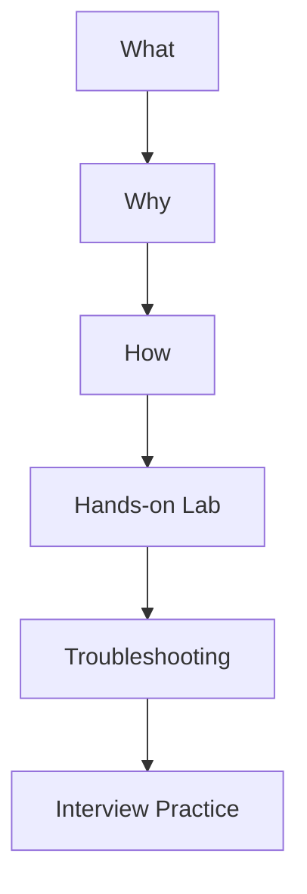
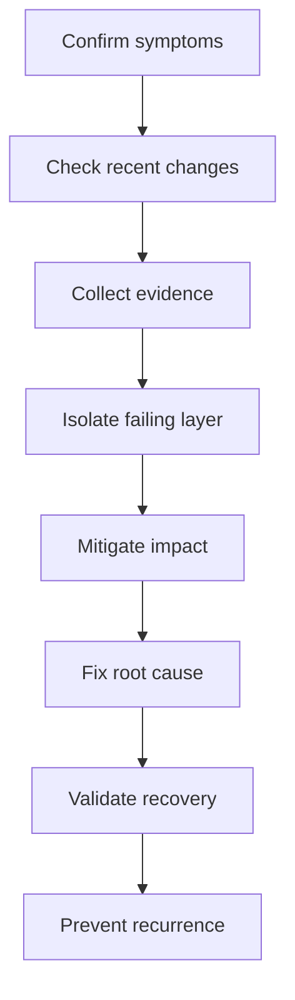

# Linux Interview Preparation

This track develops the Linux administration, troubleshooting, automation, and communication skills required for Linux System Administrator, DevOps Engineer, Cloud Engineer, Platform Engineer, and Site Reliability Engineer interviews.

Linux is the foundation of this repository because Docker hosts, Kubernetes nodes, CI/CD runners, cloud servers, automation tools, and observability platforms commonly depend on Linux.

---

## Track Objectives

After completing this track, I should be able to:

- Explain Linux architecture and the boot process.
- Navigate and describe the Linux filesystem hierarchy.
- Manage users, groups, permissions, ACLs, and special permissions.
- Analyze processes, signals, jobs, services, and system logs.
- Manage software packages, repositories, disks, filesystems, LVM, mounts, and NFS.
- Configure and troubleshoot SSH, cron, logrotate, and systemd.
- Analyze CPU, memory, load average, disk I/O, and network activity.
- Troubleshoot common Linux incidents using a structured isolation method.
- Use Bash commands and scripts to automate administrative work.
- Answer technical, scenario-based, and behavioral Linux interview questions.
- Explain Linux projects clearly in short and detailed interview formats.

---

## Learning Method

Every major Linux topic follows this workflow:



The goal is to connect theory with commands, real system behavior, failure analysis, and interview communication.

---

## Linux Track Structure

```text
01-Linux/
├── README.md
├── Study-Notes/
│   ├── 01-Linux-Interview-Preparation-Foundation.md
│   └── 02-Advanced-Linux-Administration-and-Troubleshooting.md
├── Hands-on-Labs/
├── Troubleshooting-Scenarios/
├── Interview-Questions/
├── MCQ-Quizzes/
└── Cheat-Sheets/
```

| Directory | Purpose |
|---|---|
| `Study-Notes/` | Detailed explanations, commands, diagrams, and examples |
| `Hands-on-Labs/` | Guided administration and configuration exercises |
| `Troubleshooting-Scenarios/` | Realistic failures analyzed through an isolation method |
| `Interview-Questions/` | Technical, scenario-based, and model interview answers |
| `MCQ-Quizzes/` | Interactive knowledge assessments with explanations |
| `Cheat-Sheets/` | Quick command and revision references |

---

## Module 1 — Linux Foundations

The first module covers:

- Linux distributions, kernel, shell, terminal, and hardware layers
- Linux boot process: BIOS/UEFI, GRUB, kernel, initramfs, and systemd
- Filesystem hierarchy and important directories
- Users, groups, passwords, ownership, and permissions
- SUID, SGID, sticky bit, and ACLs
- Processes, parent processes, process states, signals, and jobs
- systemd services, targets, unit files, and journal logs
- Initial system health checks
- Service, filesystem, and performance troubleshooting fundamentals

Study document:

[Linux Interview Preparation — Foundation](Study-Notes/01-Linux-Interview-Preparation-Foundation.md)

---

## Module 2 — Advanced Administration and Troubleshooting

The second module will cover:

- CPU scheduling, utilization, load average, and process priority
- Physical memory, virtual memory, swap, cache, and out-of-memory events
- Disk utilization, latency, IOPS, throughput, and inode exhaustion
- Partitions, filesystems, mounts, `/etc/fstab`, LVM, and NFS
- Package management and repositories on Debian- and RHEL-based systems
- SSH authentication, keys, configuration, banners, and access failures
- Cron, systemd timers, logrotate, and scheduled automation
- Linux networking, DNS resolution, routes, listening ports, and connectivity
- Kernel, system, authentication, application, and service logs
- Performance baselines and evidence-driven troubleshooting

---

## Core Interview Domains

| Domain | Required knowledge |
|---|---|
| Architecture | Kernel, shell, system calls, libraries, hardware, distributions |
| Boot | UEFI/BIOS, GRUB, kernel, initramfs, systemd, targets |
| Filesystem | FHS directories, links, inodes, mounts, capacity, permissions |
| Identity | Users, groups, sudo, passwords, account files, access control |
| Processes | PID, PPID, states, signals, jobs, priority, resource usage |
| Services | systemd units, dependencies, enablement, startup, journal logs |
| Storage | Partitions, filesystems, LVM, swap, NFS, persistent mounts |
| Packages | APT, DNF/YUM, RPM, repositories, updates, verification |
| Scheduling | cron, at, systemd timers, environment differences |
| Logging | journald, rsyslog, application logs, rotation, retention |
| Networking | Interfaces, IP addresses, routes, DNS, sockets, ports, firewalls |
| Security | SSH, sudo, permissions, ACLs, hardening, least privilege |
| Performance | CPU, memory, load, disk I/O, network activity, baselines |
| Troubleshooting | Evidence collection, isolation, mitigation, validation, prevention |

---

## Essential Command Groups

### System identity and environment

```bash
hostnamectl
uname -a
cat /etc/os-release
uptime
whoami
id
pwd
```

### Processes and performance

```bash
ps aux
top
pgrep -a nginx
pstree -p
free -h
vmstat 1 5
iostat -xz 1 5
```

### Filesystems and storage

```bash
df -hT
df -i
du -xhd1 /var
lsblk -f
findmnt
mount
lsof +L1
```

### Services and logs

```bash
systemctl status nginx
systemctl --failed
journalctl -u nginx
journalctl -p err -b
journalctl -f
```

### Networking

```bash
ip -br address
ip route
ss -lntup
ping -c 4 example.com
dig example.com
curl -I https://example.com
traceroute example.com
```

---

## Troubleshooting Framework

Linux scenario questions should be answered using a repeatable method:

1. Confirm the symptoms, scope, timeline, and business impact.
2. Ask about recent deployments, configuration changes, patches, or traffic changes.
3. Collect evidence before restarting services or changing configuration.
4. Isolate the failing layer: application, service, operating system, storage, network, or dependency.
5. Apply the safest immediate mitigation.
6. Identify and correct the root cause.
7. Validate service health and confirm recovery with the affected users or monitoring system.
8. Document the incident and add preventive monitoring, automation, or standards.



---

## Required Troubleshooting Scenarios

- Server is slow
- CPU utilization is high
- Memory usage or swapping is excessive
- Filesystem is full
- Filesystem has free space but no available inodes
- Service fails to start
- SSH returns `Permission denied`
- Server is reachable by IP but not by hostname
- Application is running but its port is unreachable
- A scheduled script works manually but fails through cron
- NFS share does not mount or synchronize correctly
- Deleted log file continues consuming disk space

---

## Required Hands-on Labs

1. Create and manage users and groups.
2. Build a secure shared directory using SGID and group permissions.
3. Configure standard permissions, special permissions, and ACLs.
4. Create and troubleshoot a custom systemd service.
5. Create a persistent filesystem mount using `/etc/fstab`.
6. Create and extend an LVM logical volume in a practice environment.
7. Configure an NFS server and client.
8. Configure SSH key authentication and diagnose access failures.
9. Schedule a task with cron and a systemd timer.
10. Configure logrotate for a custom application log.
11. Investigate a simulated slow-server incident.
12. Diagnose a full filesystem and a deleted-but-open file.

> Perform administrative labs only in a disposable VM, WSL distribution, container, or cloud practice instance.

---

## Two-Week Linux Plan

### Week 1 — Foundations

| Day | Focus | Deliverable |
|---:|---|---|
| 1 | Architecture and boot process | Diagram and explanation |
| 2 | Filesystem hierarchy and file operations | Filesystem command practice |
| 3 | Users, groups, permissions, and ACLs | Shared-directory lab |
| 4 | Processes, signals, services, and systemd | Custom-service lab |
| 5 | Logs and initial troubleshooting | Service-failure scenario |
| 6 | Foundation interview questions | Written and spoken answers |
| 7 | Revision and assessment | MCQ quiz and review |

### Week 2 — Administration and Troubleshooting

| Day | Focus | Deliverable |
|---:|---|---|
| 1 | CPU, memory, load average, and performance | Slow-server analysis |
| 2 | Storage, filesystems, LVM, and mounts | Storage administration lab |
| 3 | Packages, repositories, cron, and logrotate | Automation lab |
| 4 | SSH, networking, DNS, routes, and ports | Connectivity lab |
| 5 | Advanced failure scenarios | Troubleshooting runbook |
| 6 | Scenario-based interview questions | Mock technical round |
| 7 | Final review | Linux readiness assessment |

---

## Interview Practice Targets

The Linux track will include:

- 25 multiple-choice questions
- 25 short technical questions
- 15 troubleshooting scenarios
- 10 command-output interpretation exercises
- 5 architecture or design questions
- 5 behavioral questions connected to Linux administration
- One two-minute Linux project explanation
- One ten-minute Linux technical deep dive
- One timed mock interview

---

## Project Explanation Practice

For every Linux project or lab, prepare answers to these questions:

1. What problem were you solving?
2. What was the environment?
3. What was your responsibility?
4. What commands, services, or configuration files did you use?
5. What problem occurred during implementation?
6. How did you isolate and resolve it?
7. How did you validate the result?
8. What security or reliability improvements did you add?
9. What would you improve for production use?

---

## Progress Tracker

| Milestone | Status |
|---|---|
| Linux track overview | Complete |
| Foundation study notes | Complete |
| Advanced administration notes | Not Started |
| Hands-on labs | Not Started |
| Troubleshooting scenarios | Not Started |
| Cheat sheet | Not Started |
| Interview questions | Not Started |
| Interactive MCQ quiz | Not Started |
| Mock interview | Not Started |
| Final readiness assessment | Not Started |

---

## Interview-Ready Checklist

- [ ] I can explain Linux architecture without notes.
- [ ] I can describe the boot process in the correct order.
- [ ] I can explain the purpose of important Linux directories.
- [ ] I can manage users, groups, permissions, special permissions, and ACLs.
- [ ] I can analyze processes, signals, services, and logs.
- [ ] I can administer storage, filesystems, mounts, LVM, and NFS.
- [ ] I can troubleshoot SSH and network-connectivity problems.
- [ ] I can analyze CPU, memory, load average, and disk I/O evidence.
- [ ] I can troubleshoot without immediately restarting the server.
- [ ] I can answer Linux scenario questions using the isolation framework.
- [ ] I can explain one Linux project in two minutes.
- [ ] I can complete a timed Linux mock interview confidently.

---

## Next Deliverable

The next document is:

`Study-Notes/02-Advanced-Linux-Administration-and-Troubleshooting.md`

It will focus on performance analysis, storage, packages, SSH, scheduling, logging, networking, and advanced incident scenarios.

---

## Author

**Muhammad Khalid Khan**  
Linux System Administrator | DevOps | AWS | Automation  
GitHub: [krmaryum](https://github.com/krmaryum)
