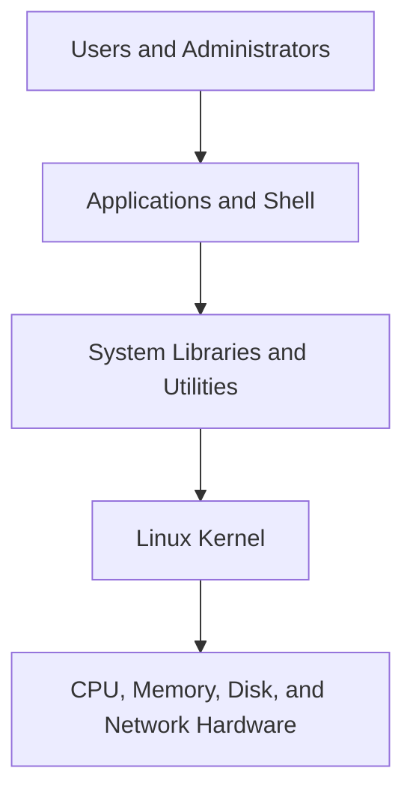
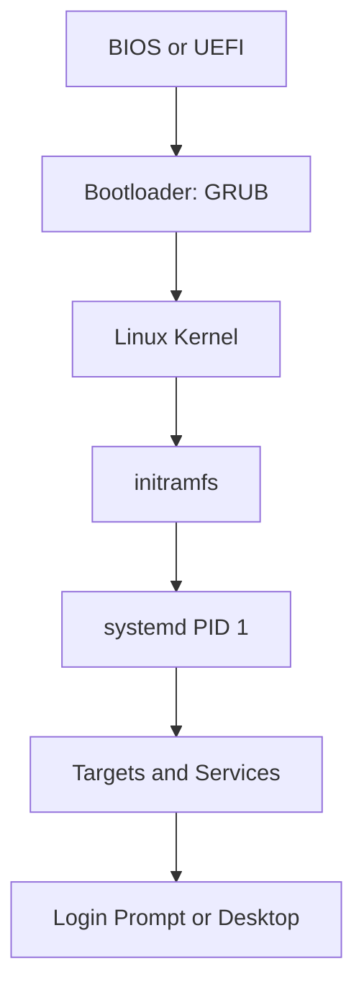
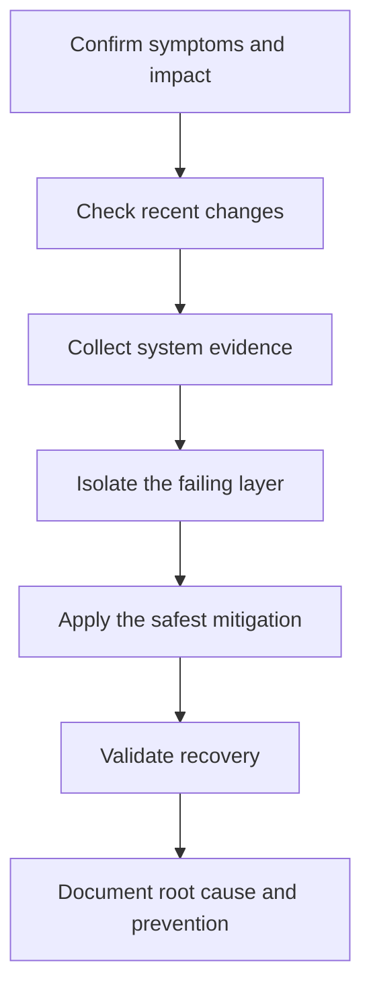

# Track 1 — Linux Interview Preparation: Foundation

**Project:** DevOps & SRE Interview Preparation  
**Prepared for:** Muhammad Khalid Khan  
**Level:** Foundation to Intermediate  
**Milestone:** Linux architecture, boot process, filesystem, permissions, processes, systemd, and essential troubleshooting

---

## 1. Learning Objectives

After completing this milestone, you should be able to:

- Explain Linux architecture from hardware to user applications.
- Describe the Linux boot process in the correct order.
- Navigate and explain the Linux filesystem hierarchy.
- Manage users, groups, ownership, permissions, and ACLs.
- Analyze running processes and use signals safely.
- Manage services with `systemd` and inspect logs with `journalctl`.
- Use a repeatable isolation method for common Linux failures.
- Answer foundational Linux interview questions with practical examples.

---

# Part 1 — Linux Architecture

## What is Linux?

Linux is an open-source operating-system kernel. A complete Linux distribution combines the Linux kernel with utilities, libraries, package-management tools, services, and applications.

Examples of Linux distributions include Ubuntu, Red Hat Enterprise Linux, AlmaLinux, Rocky Linux, Debian, and Amazon Linux.

## Architecture Layers



| Layer | Purpose | Examples |
|---|---|---|
| Users | Interact with the system | Administrator, developer, application user |
| Applications | Perform user and business tasks | Nginx, Docker, Python |
| Shell | Interprets commands | Bash, Zsh |
| Libraries/utilities | Provide reusable functions and tools | glibc, GNU utilities |
| Kernel | Manages system resources | Processes, memory, drivers, filesystems |
| Hardware | Physical or virtual resources | CPU, RAM, disks, NICs |

## Kernel Responsibilities

The kernel manages:

- Process scheduling
- Memory allocation
- Device drivers
- Filesystems
- Network communication
- System calls
- Security and access control

### Interview distinction: kernel versus shell

- The **kernel** controls hardware and system resources.
- The **shell** accepts user commands and requests services from the operating system.
- The **terminal** is the interface or application through which you interact with a shell.

---

# Part 2 — Linux Boot Process

## Boot Sequence



1. **BIOS/UEFI** performs hardware initialization and selects a boot device.
2. **GRUB** displays boot options and loads the selected kernel.
3. **Kernel** initializes CPU, memory, drivers, and core subsystems.
4. **initramfs** provides a temporary filesystem and drivers needed to mount the real root filesystem.
5. **systemd** starts as process ID 1.
6. **Targets and services** bring the system to the required operating state.
7. The system presents a login prompt or graphical interface.

## Useful Boot Commands

```bash
uname -r
cat /proc/cmdline
systemctl get-default
systemd-analyze
systemd-analyze blame
journalctl -b
journalctl -b -1
```

| Command | Purpose |
|---|---|
| `uname -r` | Show the running kernel version |
| `systemctl get-default` | Show the default systemd target |
| `systemd-analyze` | Display total boot time |
| `systemd-analyze blame` | List slow-starting units |
| `journalctl -b` | Display logs for the current boot |
| `journalctl -b -1` | Display logs for the previous boot |

---

# Part 3 — Linux Filesystem Hierarchy

Linux uses a single directory tree beginning at `/`, called the root directory.

| Path | Main purpose |
|---|---|
| `/` | Top of the filesystem hierarchy |
| `/boot` | Kernel, initramfs, and bootloader files |
| `/etc` | System-wide configuration |
| `/home` | Regular users' home directories |
| `/root` | Root user's home directory |
| `/var` | Logs, cache, spool, and changing application data |
| `/tmp` | Temporary files |
| `/usr` | Applications, libraries, and shared read-only data |
| `/bin` | Essential user commands; often linked into `/usr` |
| `/sbin` | Essential administration commands; often linked into `/usr` |
| `/dev` | Device files |
| `/proc` | Virtual process and kernel information |
| `/sys` | Virtual device and kernel interface |
| `/run` | Runtime state since the current boot |
| `/mnt` | Temporary administrator-managed mounts |
| `/media` | Removable-media mounts |
| `/opt` | Optional third-party software |

## Essential Filesystem Commands

```bash
pwd
ls -lah
find /var/log -type f -name '*.log'
df -hT
du -xh /var | sort -h | tail
lsblk -f
findmnt
mount
```

### Important interview distinction: `df` versus `du`

- `df` reports usage from the filesystem's perspective.
- `du` adds the space used by visible files and directories.
- A deleted file that is still open by a process can cause `df` to show high usage while `du` cannot find the space.
- Use `lsof +L1` to look for deleted but still-open files.

---

# Part 4 — Users, Groups, Ownership, and Permissions

## Important Account Files

| File | Purpose |
|---|---|
| `/etc/passwd` | User account information |
| `/etc/shadow` | Password hashes and password-aging data |
| `/etc/group` | Group definitions and membership |
| `/etc/gshadow` | Secure group information |
| `/etc/login.defs` | Login and account-creation defaults |
| `/etc/skel` | Template files copied into new home directories |

## User and Group Commands

```bash
id alice
getent passwd alice
sudo useradd -m -s /bin/bash alice
sudo passwd alice
sudo groupadd devops
sudo usermod -aG devops alice
groups alice
sudo userdel -r alice
```

> Be careful with `usermod -G`. Without `-a`, it can replace the user's supplementary group list.

## Standard Permissions

```text
-rwxr-x--- 1 alice devops 2048 Jul 16 deploy.sh
```

Interpretation:

- `-` — regular file
- `rwx` — owner can read, write, and execute
- `r-x` — group can read and execute
- `---` — others have no permissions
- `alice` — owner
- `devops` — group owner

## Numeric Permissions

| Permission | Value |
|---|---:|
| Read (`r`) | 4 |
| Write (`w`) | 2 |
| Execute (`x`) | 1 |

Examples:

```bash
chmod 640 report.txt
chmod 750 deploy.sh
chown alice:devops deploy.sh
```

## Directory Permission Meaning

For a directory:

- `r` permits listing filenames.
- `w` permits creating, deleting, or renaming entries.
- `x` permits entering and traversing the directory.

## Special Permissions

| Permission | Typical use |
|---|---|
| SUID | Execute a file with the file owner's effective identity |
| SGID on file | Execute with the file group's effective identity |
| SGID on directory | New files inherit the directory's group |
| Sticky bit | Only owners/root can delete their files in a shared directory |

```bash
chmod u+s program
chmod g+s /shared/project
chmod +t /shared/public
```

## ACLs

ACLs grant permissions to additional named users or groups without changing the standard owner/group model.

```bash
getfacl project.txt
setfacl -m u:bob:rw project.txt
setfacl -m g:qa:r project.txt
setfacl -m d:g:devops:rwx /shared/project
setfacl -x u:bob project.txt
```

---

# Part 5 — Processes and Signals

## What is a process?

A process is a running instance of a program. Every process has a process ID, parent process ID, owner, state, resource usage, and command.

## Process Commands

```bash
ps aux
ps -ef
pgrep -a nginx
pstree -p
top
free -h
uptime
jobs
```

## Common Process States

| State | Meaning |
|---|---|
| `R` | Running or runnable |
| `S` | Interruptible sleep |
| `D` | Uninterruptible sleep, commonly waiting on I/O |
| `T` | Stopped or traced |
| `Z` | Zombie; exited but not yet collected by its parent |

## Important Signals

| Signal | Number | Purpose |
|---|---:|---|
| `SIGHUP` | 1 | Reload or terminal hangup, depending on application |
| `SIGINT` | 2 | Interrupt, commonly from Ctrl+C |
| `SIGTERM` | 15 | Request graceful termination |
| `SIGKILL` | 9 | Force termination; cannot be handled |

```bash
kill -TERM 1234
kill -KILL 1234
pkill -HUP nginx
```

> Use `SIGTERM` first. Use `SIGKILL` only when graceful termination fails.

### Zombie versus orphan process

- A **zombie** has finished execution, but its parent has not collected the exit status.
- An **orphan** is still running after its parent exits and is adopted by PID 1 or a subreaper.

---

# Part 6 — systemd and Service Management

`systemd` is the service and system manager used by many modern Linux distributions. It normally runs as PID 1.

## Essential Commands

```bash
systemctl status nginx
sudo systemctl start nginx
sudo systemctl stop nginx
sudo systemctl restart nginx
sudo systemctl reload nginx
sudo systemctl enable nginx
sudo systemctl disable nginx
systemctl is-active nginx
systemctl is-enabled nginx
systemctl list-units --type=service --state=failed
```

### Start versus enable

- `start` runs the service now.
- `enable` configures the service to start automatically at boot.
- A service can be running but not enabled, or enabled but currently stopped.

## Unit File Locations

| Location | Purpose |
|---|---|
| `/usr/lib/systemd/system` or `/lib/systemd/system` | Package-provided units |
| `/etc/systemd/system` | Administrator-created units and overrides |
| `/run/systemd/system` | Runtime units |

After editing or adding a unit file:

```bash
sudo systemctl daemon-reload
sudo systemctl restart myapp
```

## Log Inspection

```bash
journalctl -u nginx
journalctl -u nginx --since '30 minutes ago'
journalctl -p err -b
journalctl -f
```

---

# Part 7 — Essential Troubleshooting Method

## Isolation Workflow



## Initial Snapshot

```bash
date
hostnamectl
uptime
who
free -h
df -hT
lsblk
ps aux --sort=-%cpu | head
ps aux --sort=-%mem | head
systemctl --failed
ip -br address
ip route
ss -lntup
```

## Scenario 1 — Service Will Not Start

Use this order:

```bash
systemctl status nginx --no-pager -l
journalctl -u nginx -n 100 --no-pager
nginx -t
ss -lntp
df -hT
```

Investigate:

- Invalid configuration
- Port already in use
- Missing file or directory
- Incorrect permissions
- Full filesystem
- Missing dependency
- Security policy denial

## Scenario 2 — Server Is Slow

```bash
uptime
nproc
top
free -h
vmstat 1 5
iostat -xz 1 5
df -hT
ps aux --sort=-%cpu | head
ps aux --sort=-%mem | head
```

Isolation questions:

- Is CPU saturated?
- Is the run queue consistently larger than available CPU capacity?
- Is the system swapping?
- Is disk I/O latency high?
- Is the filesystem full?
- Is one process consuming most resources?
- Did a deployment, job, backup, or traffic increase occur?

## Scenario 3 — Filesystem Is Full

```bash
df -hT
df -i
du -xhd1 /var | sort -h
find /var -xdev -type f -size +500M -ls
lsof +L1
journalctl --disk-usage
```

Check both block usage and inode usage. Do not delete files blindly; identify ownership, retention needs, and the responsible application first.

---

# Part 8 — Hands-On Administration Lab

## Scenario

Your company needs a shared workspace for the DevOps team. Members must be able to collaborate, new files must inherit the `devops` group, and users outside the team must have no access.

## Objectives

- Create the `devops` group.
- Create two practice users.
- Add both users to the group.
- Create a secure shared directory.
- Configure SGID group inheritance.
- Verify access and inheritance.
- Create and inspect a simple systemd service.

> Use a disposable VM, WSL distribution, or EC2 practice instance. Do not run account-creation commands on a production system.

## Lab A — Shared Directory

```bash
sudo groupadd devops
sudo useradd -m -s /bin/bash devuser1
sudo useradd -m -s /bin/bash devuser2
sudo usermod -aG devops devuser1
sudo usermod -aG devops devuser2

sudo mkdir -p /srv/devops-project
sudo chown root:devops /srv/devops-project
sudo chmod 2770 /srv/devops-project

ls -ld /srv/devops-project
id devuser1
id devuser2
```

Expected permission pattern:

```text
drwxrws--- root devops /srv/devops-project
```

Test group inheritance:

```bash
sudo -u devuser1 touch /srv/devops-project/from-user1.txt
ls -l /srv/devops-project
```

The new file should inherit the `devops` group.

## Lab B — Simple systemd Service

Create `/usr/local/bin/interview-health.sh`:

```bash
#!/usr/bin/env bash
while true; do
    printf '%s Linux interview service is healthy\n' "$(date --iso-8601=seconds)"
    sleep 30
done
```

Make it executable:

```bash
sudo chmod 755 /usr/local/bin/interview-health.sh
```

Create `/etc/systemd/system/interview-health.service`:

```ini
[Unit]
Description=Linux Interview Practice Health Service
After=network.target

[Service]
Type=simple
ExecStart=/usr/local/bin/interview-health.sh
Restart=on-failure
RestartSec=5

[Install]
WantedBy=multi-user.target
```

Load and start it:

```bash
sudo systemctl daemon-reload
sudo systemctl enable --now interview-health.service
systemctl status interview-health.service
journalctl -u interview-health.service -n 20 --no-pager
```

## Lab Verification Checklist

- [ ] Both users exist.
- [ ] Both users belong to `devops`.
- [ ] The shared directory is owned by `root:devops`.
- [ ] The shared directory uses mode `2770`.
- [ ] Files created inside inherit the `devops` group.
- [ ] The service is active.
- [ ] The service is enabled for boot.
- [ ] Logs are visible through `journalctl`.

## Optional Cleanup

Run only after verifying the exact practice resources:

```bash
sudo systemctl disable --now interview-health.service
sudo rm /etc/systemd/system/interview-health.service
sudo rm /usr/local/bin/interview-health.sh
sudo systemctl daemon-reload
sudo userdel -r devuser1
sudo userdel -r devuser2
sudo rm -rf /srv/devops-project
sudo groupdel devops
```

---

# Part 9 — Interview Questions and Model Answers

## 1. What happens when you enter a command in a Linux shell?

The shell parses the command, performs expansions and redirections, resolves built-ins or searches for an executable through `PATH`, creates a process when needed, and asks the kernel to execute it. The kernel schedules the process and manages its resource access. The shell then receives the exit status.

## 2. What is the difference between a process and a service?

A process is any running program. A service is a long-running background function usually managed by a service manager such as `systemd`. A service runs through one or more processes.

## 3. What is PID 1, and why is it important?

PID 1 is the first userspace process started by the kernel. On most modern distributions it is `systemd`. It initializes system services and also has special responsibility for adopting and reaping orphaned processes.

## 4. What is load average?

Load average represents the average number of tasks running or waiting for CPU, plus tasks in uninterruptible sleep on Linux, over 1, 5, and 15 minutes. It must be compared with CPU count, workload behavior, and other evidence; it is not the same as CPU percentage.

## 5. What is the difference between a hard link and a symbolic link?

A hard link is another directory entry pointing to the same inode and normally cannot cross filesystems. A symbolic link is a separate file containing a path to another file and can cross filesystems, but it can become broken if the target moves or is deleted.

## 6. What does permission `755` mean?

The owner has read, write, and execute permissions (`7`). The group and others each have read and execute permissions (`5`).

## 7. Why might `df` show a full filesystem while `du` cannot locate the space?

A common reason is a deleted file that remains open by a process. The directory entry is gone, so `du` cannot see it, but the filesystem blocks remain allocated until the process closes the file. `lsof +L1` can help identify it.

## 8. What is the difference between `systemctl start` and `systemctl enable`?

`start` runs the service in the current session. `enable` configures it to start automatically during boot. `enable --now` performs both actions.

## 9. Why should `kill -9` not be the first choice?

`SIGKILL` cannot be caught or handled, so the process cannot clean up locks, temporary files, or transactions. Start with `SIGTERM` to request a graceful shutdown, then escalate only if necessary.

## 10. How would you investigate a failed Linux service?

I would confirm the service status, review its recent logs, validate its configuration, check dependencies and permissions, confirm required ports and files, verify disk space, review recent changes, apply the safest fix, and then validate the service and monitoring.

---

# Part 10 — Practice Questions Without Answers

Answer these aloud in one to two minutes each:

1. Explain the Linux boot process.
2. What is the difference between `/proc`, `/sys`, and `/dev`?
3. What happens when a process becomes a zombie?
4. How do directory permissions differ from file permissions?
5. How would you find the largest files under `/var` without crossing filesystems?
6. What is an inode, and how can a filesystem run out of inodes?
7. What is the purpose of `/etc/fstab`?
8. What information would you collect before restarting a slow server?
9. How do `nice` and `renice` affect process scheduling priority?
10. What is the difference between `systemctl reload` and `restart`?

---

# Part 11 — Completion Checklist

- [ ] I can draw and explain Linux architecture.
- [ ] I can explain the boot process without notes.
- [ ] I know the purpose of the major filesystem directories.
- [ ] I can create users, groups, and secure shared directories.
- [ ] I can interpret symbolic and numeric permissions.
- [ ] I understand SUID, SGID, sticky bit, and ACLs.
- [ ] I can inspect processes and select the correct signal.
- [ ] I can manage and troubleshoot a systemd service.
- [ ] I completed the hands-on lab.
- [ ] I answered the interview questions aloud.

---

# Next Milestone

**Linux Interview Preparation — Advanced Administration and Troubleshooting**

It will cover:

- CPU, memory, load average, and disk I/O analysis
- Storage, partitions, filesystems, LVM, mounts, and NFS
- Package management and repositories
- SSH, authentication, and access troubleshooting
- Logs, cron, logrotate, and scheduled automation
- Networking commands and service connectivity
- Real incident scenarios and advanced interview questions
