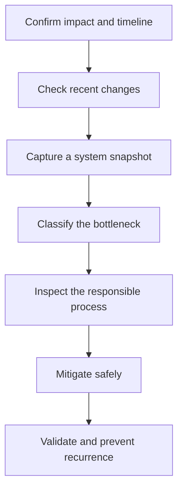
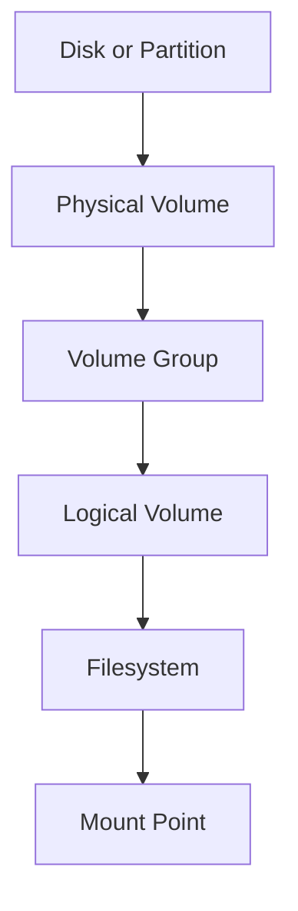
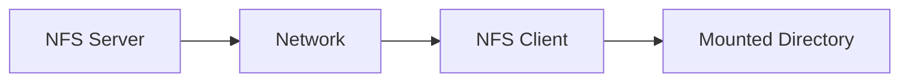
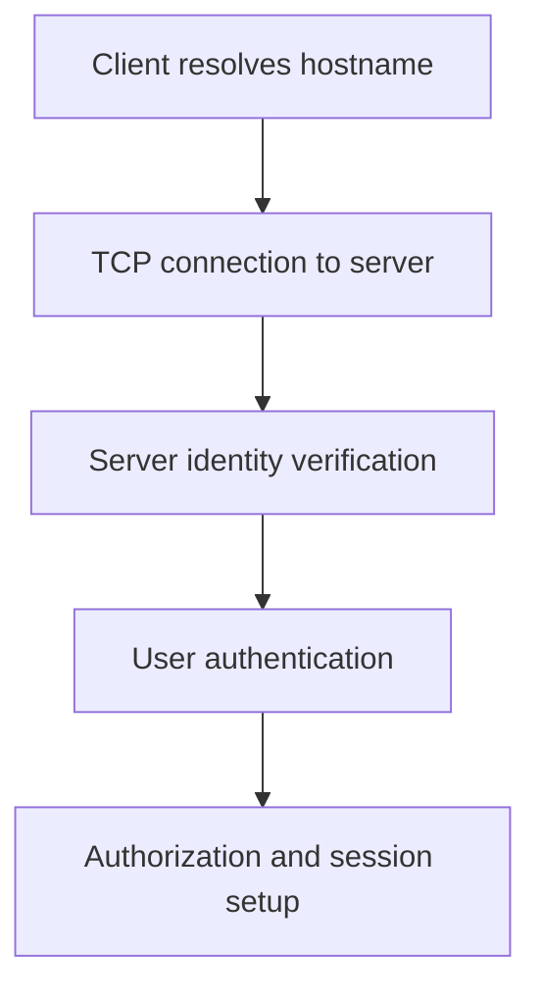
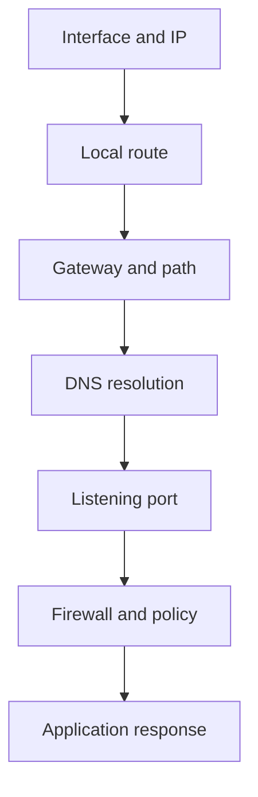

# Advanced Linux Administration and Troubleshooting

**Package:** 01 — Linux Interview Preparation  
**Level:** Intermediate to Advanced  
**Prepared for:** Muhammad Khalid Khan

This module develops the evidence-based administration and incident-troubleshooting skills expected in Linux System Administrator, DevOps, Platform Engineering, Cloud Engineering, and SRE interviews.

---

## Learning Objectives

After completing this module, I should be able to:

- Analyze CPU, memory, load, disk I/O, and network evidence.
- Distinguish symptoms from root causes.
- Manage partitions, filesystems, mounts, LVM, swap, and NFS.
- Work with packages and repositories on Ubuntu and RHEL-family systems.
- Configure and troubleshoot SSH authentication and access.
- Schedule work with cron and systemd timers.
- Configure log rotation and investigate system logs.
- Diagnose DNS, routing, listening-port, and connectivity problems.
- Explain safe mitigation, recovery validation, and recurrence prevention.

---

# 1. Performance Troubleshooting Model

Performance troubleshooting should begin with scope and evidence, not assumptions.



## Initial Questions

- When did the problem begin?
- Is one host, one application, or every user affected?
- Is the problem constant or intermittent?
- Did a deployment, patch, configuration change, backup, or traffic increase occur?
- What does normal performance look like?
- Which monitoring alert or user symptom first revealed the problem?

## Initial System Snapshot

```bash
date
hostnamectl
uptime
nproc
free -h
df -hT
df -i
lsblk -f
systemctl --failed
ps aux --sort=-%cpu | head
ps aux --sort=-%mem | head
ip -br address
ip route
ss -lntup
```

Capture evidence before restarting a service because a restart may remove the state needed for root-cause analysis.

---

# 2. CPU and Load Average

## CPU Metrics

| Metric | Meaning |
|---|---|
| User time | CPU used by normal user-space processes |
| System time | CPU used by kernel operations |
| Idle time | CPU capacity not in use |
| I/O wait | Time a CPU is idle while tasks wait for I/O completion |
| Steal time | Time a virtual CPU waits while the hypervisor serves another VM |

## Useful Commands

```bash
uptime
nproc
top
ps -eo pid,ppid,user,stat,ni,pri,%cpu,%mem,cmd --sort=-%cpu | head
mpstat -P ALL 1 5
pidstat 1 5
vmstat 1 5
```

## Understanding Load Average

Linux load average represents the average number of tasks that are:

- Running or waiting to run on CPU
- Waiting in uninterruptible sleep, commonly for disk or network-backed I/O

`uptime` displays averages for the last 1, 5, and 15 minutes.

```text
load average: 1.20, 0.95, 0.70
```

Interpret load relative to:

- Number of logical CPUs (`nproc`)
- Workload type
- Duration of the increase
- CPU utilization
- I/O wait
- Runnable and blocked task counts

Load of `4.00` may be acceptable on an 8-CPU server but can indicate sustained pressure on a 2-CPU server. This comparison is a starting point, not a final diagnosis.

## Run Queue and Blocked Tasks

`vmstat` fields to observe:

| Field | Meaning |
|---|---|
| `r` | Runnable tasks waiting for CPU |
| `b` | Tasks blocked in uninterruptible sleep |
| `us` | User CPU percentage |
| `sy` | System CPU percentage |
| `wa` | I/O wait percentage |
| `st` | Steal percentage |

### Interview Scenario

If load is high but CPU utilization is low, investigate blocked tasks and I/O latency. High load is not automatically a CPU problem.

## Process Priority

Linux niceness usually ranges from `-20` (higher scheduling priority) to `19` (lower scheduling priority).

```bash
nice -n 10 command
sudo renice 5 -p 1234
ps -o pid,ni,pri,cmd -p 1234
```

Changing priority can reduce impact, but it does not correct an inefficient application or capacity problem.

---

# 3. Memory and Swap

## Memory Concepts

| Term | Meaning |
|---|---|
| Physical memory | Installed or assigned RAM |
| Used memory | Memory used by processes and the kernel |
| Available memory | Estimated memory available without heavy swapping |
| Page cache | Filesystem data cached in RAM for performance |
| Swap | Disk-backed space used for inactive memory pages |
| OOM killer | Kernel mechanism that terminates processes during severe memory exhaustion |

## Useful Commands

```bash
free -h
vmstat 1 5
ps aux --sort=-%mem | head
ps -eo pid,user,%mem,rss,vsz,cmd --sort=-rss | head
swapon --show
cat /proc/meminfo
journalctl -k | grep -i -E 'out of memory|oom|killed process'
```

## RSS versus VSZ

- **RSS** is the resident memory currently held in RAM.
- **VSZ** is the total virtual address space associated with a process.
- A large VSZ value alone does not prove that a process consumes the same amount of physical RAM.

## Cache Is Not Automatically a Problem

Linux uses otherwise-free memory for cache. Focus on `available`, swap activity, application latency, and memory pressure rather than treating a small `free` value as failure.

## Swap Investigation

In `vmstat`:

- `si` shows swap-in activity.
- `so` shows swap-out activity.

Sustained swap activity combined with latency and low available memory can indicate pressure.

## OOM Investigation

```bash
journalctl -k --since '2 hours ago'
dmesg -T | grep -i -E 'oom|out of memory|killed process'
```

Determine:

- Which process was killed?
- Was there a memory leak or traffic spike?
- Were container or service limits configured?
- Was system capacity adequate?
- Did monitoring alert before the failure?

---

# 4. Disk Capacity, Inodes, and I/O

## Capacity Commands

```bash
df -hT
df -i
du -xhd1 /var | sort -h
find /var -xdev -type f -size +500M -ls
lsof +L1
```

## Blocks versus Inodes

- Disk blocks store file content.
- Inodes store file metadata and references to data blocks.
- A filesystem can have free disk space but reject new files because all inodes are used.

Use both:

```bash
df -h
df -i
```

## Why `df` and `du` May Disagree

A process can keep a deleted file open. The filename disappears, so `du` cannot count it, but its disk blocks remain allocated until the process closes the file.

```bash
lsof +L1
```

Safest resolution:

1. Identify the owning process and file descriptor.
2. Determine whether the service can reopen its logs through a reload or supported signal.
3. Restart the service only if required and approved.
4. Verify that disk space returns.
5. Correct log rotation or application behavior.

## I/O Performance

```bash
iostat -xz 1 5
pidstat -d 1 5
iotop
vmstat 1 5
```

Important `iostat` concepts:

| Metric | Meaning |
|---|---|
| `r/s`, `w/s` | Read and write operations per second |
| `rkB/s`, `wkB/s` | Data throughput |
| `await` | Average I/O request latency |
| Queue size | Outstanding work waiting for the device |
| `%util` | Time the device was busy; interpret with device type and architecture |

Avoid using one metric or one sample as proof. Compare current values with baselines and application symptoms.

---

# 5. Partitions, Filesystems, and Mounts

## Inspect Storage

```bash
lsblk -f
blkid
findmnt
df -hT
sudo fdisk -l
```

## Temporary Mount

```bash
sudo mkdir -p /data
sudo mount /dev/xvdf1 /data
findmnt /data
```

A command-line mount normally does not survive reboot.

## Persistent Mount with `/etc/fstab`

Prefer a UUID because device names can change.

```bash
sudo blkid /dev/xvdf1
```

Example entry:

```fstab
UUID=1234-5678  /data  xfs  defaults,nofail  0  2
```

Validate before rebooting:

```bash
sudo mount -a
findmnt /data
```

An invalid `/etc/fstab` entry can delay or prevent normal boot. Keep a separate administrative session open while testing remote systems.

## ext4 versus XFS

| Area | ext4 | XFS |
|---|---|---|
| Common use | General-purpose Linux filesystem | Large filesystems and high-throughput workloads |
| Online growth | Supported | Supported |
| Shrinking | Supported offline with restrictions | Not supported |
| Tools | `e2fsck`, `resize2fs` | `xfs_repair`, `xfs_growfs` |

Always verify the filesystem type and platform procedure before repair or resizing.

---

# 6. LVM Administration

LVM provides flexible storage management through layers:



## Inspect LVM

```bash
sudo pvs
sudo vgs
sudo lvs
sudo pvdisplay
sudo vgdisplay
sudo lvdisplay
```

## Example Creation Flow

Run only in a disposable lab with the correct unused device.

```bash
sudo pvcreate /dev/xvdf
sudo vgcreate vg_data /dev/xvdf
sudo lvcreate -L 5G -n lv_app vg_data
sudo mkfs.xfs /dev/vg_data/lv_app
sudo mkdir -p /appdata
sudo mount /dev/vg_data/lv_app /appdata
```

## Extending a Logical Volume

```bash
sudo lvextend -L +2G /dev/vg_data/lv_app
sudo xfs_growfs /appdata
```

For ext4, the filesystem growth command commonly uses `resize2fs` against the logical-volume device.

Before extending:

- Confirm the correct logical volume and mount point.
- Check free space in the volume group.
- Verify filesystem type.
- Confirm backup and change procedures.
- Monitor the operation and validate capacity afterward.

---

# 7. NFS Administration

NFS allows a server to export directories that clients mount over a network.



## Server Checks

```bash
systemctl status nfs-server
exportfs -v
showmount -e localhost
ss -lntup
```

Ubuntu service names and packages may differ from RHEL-family systems.

Example `/etc/exports` entry:

```exports
/nfs/share 172.31.0.0/16(rw,sync,no_subtree_check)
```

Reload exports:

```bash
sudo exportfs -rav
```

## Client Checks

```bash
showmount -e nfs-server.example.com
sudo mount -t nfs nfs-server.example.com:/nfs/share /mnt/nfs-share
findmnt /mnt/nfs-share
```

## NFS Troubleshooting Order

1. Confirm client-to-server connectivity.
2. Verify name resolution or test the server IP.
3. Confirm NFS services are active.
4. Confirm the expected directory is exported to the client's network.
5. Check firewall and security rules.
6. Verify mount options and filesystem permissions.
7. Review server and client logs.
8. Test read and write behavior with known user identities.

---

# 8. Package Management and Repositories

## Debian and Ubuntu

```bash
sudo apt update
apt list --upgradable
sudo apt install nginx
apt-cache policy nginx
dpkg -l | grep nginx
dpkg -L nginx
```

## RHEL, AlmaLinux, and Rocky Linux

```bash
sudo dnf makecache
sudo dnf check-update
sudo dnf install nginx
dnf info nginx
rpm -q nginx
rpm -ql nginx
```

## Interview Distinctions

- `rpm` and `dpkg` work with installed packages and package files.
- `dnf` and `apt` resolve dependencies and use configured repositories.
- Repository metadata problems, DNS failures, proxy settings, certificate errors, locks, and insufficient disk space can all cause package operations to fail.

## Package Troubleshooting

```bash
df -hT
date
cat /etc/resolv.conf
curl -I https://repository-url.example
```

Then inspect the appropriate repository definitions and package-manager logs for the distribution.

---

# 9. SSH Authentication and Access Troubleshooting

## SSH Connection Flow



## Client-Side Diagnostics

```bash
ssh -vvv user@server
getent hosts server
nc -vz server 22
ssh-keygen -F server
```

## Server-Side Diagnostics

```bash
systemctl status sshd
ss -lntp | grep ':22'
sudo sshd -t
journalctl -u sshd
sudo tail -f /var/log/secure
```

Ubuntu commonly uses `/var/log/auth.log`; RHEL-family systems commonly use `/var/log/secure`.

## Public-Key Permission Checks

Typical secure permissions:

```bash
chmod 700 ~/.ssh
chmod 600 ~/.ssh/authorized_keys
chmod 600 ~/.ssh/id_ed25519
chmod 644 ~/.ssh/id_ed25519.pub
```

Also verify:

- Correct user and home directory
- Ownership of the home directory and `.ssh` content
- Public key is in the correct `authorized_keys`
- `AllowUsers`, `AllowGroups`, `DenyUsers`, or `DenyGroups`
- `PasswordAuthentication` and `PubkeyAuthentication`
- Account lock, expiration, and login shell
- SELinux context where applicable
- Cloud security group, firewall, route, and public/private addressing

## Safe Configuration Change

Before restarting SSH remotely:

1. Keep the current administrative session open.
2. Validate configuration with `sshd -t`.
3. Prefer reload when supported and sufficient.
4. Test a second connection before closing the original session.

---

# 10. Cron and systemd Timers

## Cron

```bash
crontab -l
crontab -e
sudo crontab -u appuser -l
```

Example:

```cron
15 2 * * * /usr/local/bin/backup.sh >> /var/log/backup.log 2>&1
```

## Why a Script Works Manually but Fails in Cron

Common causes:

- Minimal `PATH`
- Different working directory
- Different user or permissions
- Missing environment variables
- Relative paths
- Unavailable credentials
- Shell differences
- Output or errors are not captured
- Script is not executable

Use absolute paths and explicit configuration:

```bash
#!/usr/bin/env bash
PATH=/usr/local/sbin:/usr/local/bin:/usr/sbin:/usr/bin:/sbin:/bin
cd /opt/myapp || exit 1
```

## systemd Timer Advantages

Systemd timers provide service integration, dependency management, centralized logging, missed-run handling, and detailed status.

```bash
systemctl list-timers --all
systemctl status backup.timer
journalctl -u backup.service
```

---

# 11. Logrotate

Log rotation prevents application logs from growing without limit.

Example `/etc/logrotate.d/myapp`:

```text
/var/log/myapp/*.log {
    daily
    rotate 14
    compress
    delaycompress
    missingok
    notifempty
    create 0640 myapp adm
    sharedscripts
    postrotate
        systemctl reload myapp >/dev/null 2>&1 || true
    endscript
}
```

## Validate Configuration

```bash
sudo logrotate -d /etc/logrotate.d/myapp
sudo logrotate -f /etc/logrotate.d/myapp
```

- `-d` performs a debug/dry-run style evaluation without rotating.
- `-f` forces rotation and should be used carefully in a lab or approved maintenance context.

Common failures include incorrect ownership, invalid syntax, an application that does not reopen its file, and conflicting rotation mechanisms.

---

# 12. Linux Networking Troubleshooting

## Layered Isolation



## Essential Commands

```bash
ip -br link
ip -br address
ip route
ip route get 8.8.8.8
ss -lntup
getent hosts example.com
dig example.com
ping -c 4 gateway-address
traceroute example.com
curl -v https://example.com
nc -vz server 443
tcpdump -ni any port 443
```

## Common Scenarios

### Reachable by IP but not hostname

Focus on:

- Resolver configuration
- DNS server reachability
- Search domains
- Incorrect records or caching
- `/etc/hosts`

### Service runs but remote users cannot connect

Check:

1. Does the process exist?
2. Is it listening on the expected IP and port?
3. Is it bound only to `127.0.0.1`?
4. Does the local connection work?
5. Do host firewall and cloud security rules allow traffic?
6. Is the route correct in both directions?
7. Does packet capture show traffic arriving and leaving?

### Connection refused versus timeout

- **Connection refused** often means the destination host replied but no service accepted that port, or a firewall actively rejected it.
- **Timeout** often suggests dropped traffic, routing failure, security filtering, or a nonresponsive path.

These are clues, not absolute proof; validate with packet and service evidence.

---

# 13. Logging and Evidence Collection

## Important Log Sources

| Source | Use |
|---|---|
| `journalctl` | systemd unit, kernel, boot, and system messages |
| `/var/log/messages` | General RHEL-family messages where configured |
| `/var/log/syslog` | General Ubuntu/Debian messages where configured |
| `/var/log/secure` | RHEL-family authentication and security events |
| `/var/log/auth.log` | Ubuntu/Debian authentication events |
| Application logs | Application-specific errors and transactions |
| Audit logs | Security policy and audited system calls |

## Useful Queries

```bash
journalctl -b
journalctl -b -1
journalctl -p err -b
journalctl -u nginx --since '1 hour ago'
journalctl -k
journalctl --since '2026-07-17 10:00' --until '2026-07-17 10:30'
```

Correlate logs using:

- Accurate system time and timezone
- Hostname
- Service name
- Process ID
- Request or transaction identifier
- Source and destination address
- Deployment or change timestamps

---

# 14. Advanced Incident Scenarios

## Scenario A — High Load, Low CPU

1. Confirm load trend and CPU count.
2. Inspect `vmstat` runnable and blocked tasks.
3. Review I/O wait and disk latency.
4. Find tasks in `D` state.
5. Inspect storage, NFS, or dependency health.
6. Mitigate the blocked workload safely.
7. Validate latency and load recovery.

## Scenario B — Service Fails After Configuration Change

1. Confirm the failure and change timeline.
2. Run the application's configuration validator.
3. Review `systemctl status` and `journalctl`.
4. Check files, permissions, dependencies, ports, and storage.
5. Restore the last known good configuration if required.
6. Start or reload the service.
7. Validate locally, remotely, and through monitoring.
8. Add automated configuration validation to the deployment process.

## Scenario C — Root Filesystem Is Full

1. Check blocks and inodes.
2. Identify large top-level directories without crossing filesystems.
3. Find large recent files.
4. Check deleted-but-open files.
5. Inspect journal and application log growth.
6. Free space using an approved, low-risk method.
7. Correct retention, rotation, or capacity.
8. Add early-warning alerts.

## Scenario D — SSH Permission Denied

1. Confirm username, hostname, port, and key.
2. Use verbose client output.
3. Confirm account existence, status, expiration, and shell.
4. Verify home, `.ssh`, and `authorized_keys` ownership and permissions.
5. Review server authentication logs.
6. Inspect SSH access rules and authentication settings.
7. Check SELinux context where applicable.
8. Test through a second session before closing the working session.

---

# 15. Interview Questions with Short Answers

## 1. Why can load average be high when CPU usage is low?

Linux load includes runnable tasks and tasks in uninterruptible sleep. Storage, NFS, or other I/O waits can raise load even when CPU is not saturated.

## 2. What is the difference between free and available memory?

Free memory is completely unused. Available memory estimates how much can be used for new workloads without heavy swapping, including reclaimable cache.

## 3. How can a filesystem be full when large files are not visible?

It may be out of inodes, or a deleted file may still be open by a process. Check `df -i` and `lsof +L1`.

## 4. Why use UUIDs in `/etc/fstab`?

UUIDs remain associated with a filesystem even when kernel device names change, making persistent mounts more reliable.

## 5. What is the difference between a physical volume, volume group, and logical volume?

A physical volume supplies storage to LVM. A volume group pools one or more physical volumes. A logical volume allocates usable virtual block storage from that pool.

## 6. Why might a cron job fail when the script works manually?

Cron uses a limited environment and may run as a different user with a different working directory, PATH, shell, permissions, and credentials.

## 7. How do you safely modify SSH configuration remotely?

Keep the current session open, validate with `sshd -t`, reload or restart carefully, test a second connection, and close the original session only after verification.

## 8. What does connection refused tell you?

It indicates an active response that the connection was not accepted, commonly because no service listens on that address and port or a policy actively rejected it.

## 9. What evidence should be captured before restarting a failed service?

Service status, logs, process state, configuration validation, listening ports, resource state, dependency health, and recent change information.

## 10. What should happen after service recovery?

Confirm user-facing and monitoring recovery, document the root cause, and add prevention through automation, validation, capacity, alerting, or operational standards.

---

# 16. Administration Safety Checklist

- [ ] Confirm the correct host, account, device, filesystem, and service.
- [ ] Understand business impact and change authorization.
- [ ] Capture current state and relevant evidence.
- [ ] Validate configuration before reload or restart.
- [ ] Keep rollback instructions available.
- [ ] Avoid deleting logs or data without confirming retention requirements.
- [ ] Test persistent mount entries before reboot.
- [ ] Keep an existing SSH session open during remote access changes.
- [ ] Verify the result locally, remotely, and through monitoring.
- [ ] Document the change and preventive action.

---

# 17. Module Completion Checklist

- [ ] I can distinguish CPU saturation from I/O-driven load.
- [ ] I can explain memory availability, cache, swap, and OOM events.
- [ ] I can investigate capacity, inode, and deleted-file problems.
- [ ] I can explain disk latency, throughput, and IOPS evidence.
- [ ] I can create and validate persistent mounts.
- [ ] I understand LVM layers and safe extension workflow.
- [ ] I can troubleshoot an NFS mount systematically.
- [ ] I can compare Debian and RHEL package-management tools.
- [ ] I can diagnose SSH authentication and connectivity failures.
- [ ] I can explain cron environment problems and systemd timers.
- [ ] I can configure and validate logrotate.
- [ ] I can isolate Linux networking failures layer by layer.
- [ ] I can correlate logs with incident timelines.
- [ ] I can answer the four advanced incident scenarios aloud.

---

## Next Phase of Package 01

The core learning documents are followed by:

1. `Hands-on-Labs/Linux-Hands-on-Labs.md`
2. `Troubleshooting-Scenarios/Linux-Troubleshooting-Scenarios.md`
3. `Interview-Questions/Linux-Interview-Questions-and-Answers.md`
4. `Cheat-Sheets/Linux-Interview-Cheat-Sheet.md`
5. `MCQ-Quizzes/Linux-Interview-MCQ-Quiz.html`
6. `Mock-Interview/Linux-Mock-Interview.md`

