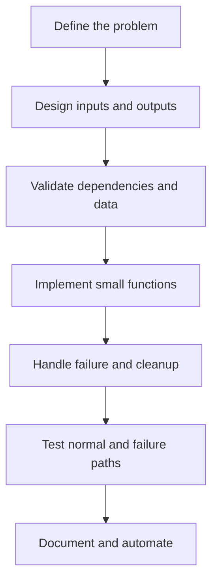

# Bash Scripting Interview Preparation

This package develops the Bash scripting, Linux automation, defensive programming, debugging, and communication skills required for Linux System Administrator, DevOps, Cloud, Platform Engineering, and SRE interviews.

Bash is used to connect operating-system commands into repeatable workflows. Interview readiness requires more than syntax: scripts must validate input, handle failures, produce useful logs, return meaningful exit statuses, and behave safely when executed repeatedly.

---

## Package Objectives

After completing this package, I should be able to:

- Explain how Bash parses and executes commands.
- Use variables, quoting, expansion, redirection, pipes, and command substitution correctly.
- Accept interactive input and command-line arguments safely.
- Build decisions with tests, exit statuses, `if`, and `case`.
- Control repeated work with loops, counters, `break`, and `continue`.
- Design reusable functions with parameters, local variables, output, and return statuses.
- Work with indexed and associative arrays.
- Parse options with `getopts`.
- Handle errors with validation, traps, cleanup, and `set -Eeuo pipefail` where appropriate.
- Use temporary files and sensitive data safely.
- Debug with `bash -n`, `bash -x`, ShellCheck, and targeted logging.
- Write idempotent administration scripts.
- Explain and troubleshoot scripts in technical interviews.

---

## Learning Method



Every script should answer:

1. What problem does it solve?
2. Who runs it and with which privileges?
3. What inputs and dependencies does it require?
4. What changes does it make?
5. How does it report success and failure?
6. Can it be run safely more than once?
7. How is it tested, logged, and maintained?

---

## Package Structure

```text
02-Bash-Scripting/
├── README.md
├── Study-Notes/
│   ├── 01-Bash-Scripting-Foundations.md
│   └── 02-Advanced-Bash-Automation.md
├── Scripts/
│   ├── README.md
│   └── linux-health-report.sh
├── Hands-on-Labs/
│   └── Bash-Hands-on-Labs.md
├── Troubleshooting-Scenarios/
│   └── Bash-Troubleshooting-Scenarios.md
├── Interview-Questions/
│   └── Bash-Interview-Questions-and-Answers.md
├── MCQ-Quizzes/
│   └── Bash-Interview-MCQ-Quiz.html
├── Cheat-Sheets/
│   └── Bash-Interview-Cheat-Sheet.md
└── Mock-Interview/
    └── Bash-Mock-Interview.md
```

---

## Study Modules

### Module 1 — Foundations

- Bash, shells, scripts, shebang, and execution
- Variables, environment variables, and scope
- Single quotes, double quotes, and unquoted expansion
- Command substitution and arithmetic expansion
- Standard input, output, error, pipes, and redirection
- Interactive input and positional parameters
- Tests, exit statuses, `if/elif/else`, and `case`
- `for`, `while`, and `until` loops
- Functions, parameters, local variables, and return statuses

[Open Bash Foundations](Study-Notes/01-Bash-Scripting-Foundations.md)

### Module 2 — Advanced Automation

- Arrays and associative arrays
- `getopts` and command-line interfaces
- Strict mode and its tradeoffs
- Traps, signals, temporary files, and cleanup
- Logging and structured output
- Idempotency and safe change control
- Concurrency and lock files
- Secure secret handling
- Debugging, ShellCheck, testing, and maintainability
- Cron and systemd execution environments

[Open Advanced Bash Automation](Study-Notes/02-Advanced-Bash-Automation.md)

---

## Required Production Project

The package includes a Linux health-report script that:

- Validates required commands.
- Accepts command-line options.
- Collects system, CPU, memory, disk, service, and network data.
- Supports configurable warning thresholds.
- Writes human-readable output and optional logs.
- Uses functions and local variables.
- Returns meaningful exit statuses.
- Handles errors and temporary resources safely.
- Can be run interactively or through automation.

[Open the Production Script](Scripts/linux-health-report.sh)

---

## Interview Domains

| Domain | Required knowledge |
|---|---|
| Execution | Shebang, interpreter, permissions, PATH, subshells, sourcing |
| Expansion | Variables, parameters, commands, arithmetic, globbing, word splitting |
| Quoting | Single, double, escape, arrays, safe arguments |
| Streams | stdin, stdout, stderr, pipes, file descriptors, redirection |
| Input | `read`, positional parameters, `$@`, `$*`, `shift`, `getopts` |
| Decisions | Exit status, `test`, `[ ]`, `[[ ]]`, `if`, `case`, logical operators |
| Repetition | `for`, `while`, `until`, counters, `break`, `continue` |
| Functions | Parameters, local variables, stdout, return codes, reuse |
| Data | Strings, arithmetic, indexed arrays, associative arrays |
| Reliability | Validation, strict mode, traps, cleanup, idempotency |
| Security | Least privilege, secrets, quoting, temporary files, permissions |
| Quality | ShellCheck, syntax checks, tracing, tests, documentation |
| Automation | Cron, systemd timers, environment, logging, monitoring |

---

## Required Hands-on Labs

1. Script execution and interpreter inspection
2. Variables, quoting, and expansion
3. Input, arguments, and validation
4. Exit statuses and conditional decisions
5. Loops and file-processing workflows
6. Reusable function library
7. Arrays and configuration mapping
8. `getopts` command-line interface
9. Traps, temporary files, and cleanup
10. Logging and error reporting
11. Idempotent user or directory management
12. Health-report capstone and failure injection

---

## Required Troubleshooting Scenarios

- Script has `Permission denied`
- Script reports `bad interpreter`
- Windows CRLF line endings break execution
- Unquoted variable causes word splitting or glob expansion
- Empty variable creates a dangerous target
- Pipeline failure is hidden
- `set -e` behaves unexpectedly
- Script works manually but fails in cron
- Function output conflicts with logging output
- Temporary file or lock remains after interruption
- Script creates duplicate resources on every run
- Script exposes a secret in arguments, logs, or tracing
- Command substitution removes trailing newlines
- Loop runs in a subshell and loses variable changes
- Exit code does not represent the reported result

---

## Two-Week Bash Plan

### Week 1 — Language and Control Flow

| Day | Focus | Deliverable |
|---:|---|---|
| 1 | Shells, execution, variables, and quoting | Safe starter script |
| 2 | Input, arguments, substitution, and streams | Input-processing script |
| 3 | Tests, exit statuses, `if`, and `case` | Decision script |
| 4 | Loops, counters, `break`, and `continue` | Batch-processing script |
| 5 | Functions, local variables, and reuse | Function library |
| 6 | Foundation questions and debugging | Review report |
| 7 | Assessment | Foundation quiz |

### Week 2 — Production Automation

| Day | Focus | Deliverable |
|---:|---|---|
| 1 | Arrays and option parsing | CLI tool |
| 2 | Strict mode, traps, and cleanup | Defensive script |
| 3 | Logging, security, and idempotency | Administration automation |
| 4 | Cron, systemd, and environment differences | Scheduled workflow |
| 5 | Testing, ShellCheck, and failure injection | Validated capstone |
| 6 | Scenario questions | Mock technical round |
| 7 | Final review | Bash readiness assessment |

---

## Interview Practice Targets

- 25 interactive multiple-choice questions
- 40 interview questions with model answers
- 15 troubleshooting scenarios
- 12 hands-on labs
- 10 code-reading exercises
- One production-style automation script
- One 60-minute mock interview

---

## Package Deliverables

| Deliverable | File |
|---|---|
| Bash foundation notes | [01-Bash-Scripting-Foundations.md](Study-Notes/01-Bash-Scripting-Foundations.md) |
| Advanced automation notes | [02-Advanced-Bash-Automation.md](Study-Notes/02-Advanced-Bash-Automation.md) |
| Production project guide | [Scripts/README.md](Scripts/README.md) |
| Linux health-report script | [linux-health-report.sh](Scripts/linux-health-report.sh) |
| Twelve hands-on labs | [Bash-Hands-on-Labs.md](Hands-on-Labs/Bash-Hands-on-Labs.md) |
| Fifteen troubleshooting scenarios | [Bash-Troubleshooting-Scenarios.md](Troubleshooting-Scenarios/Bash-Troubleshooting-Scenarios.md) |
| Forty interview questions and answers | [Bash-Interview-Questions-and-Answers.md](Interview-Questions/Bash-Interview-Questions-and-Answers.md) |
| Bash interview cheat sheet | [Bash-Interview-Cheat-Sheet.md](Cheat-Sheets/Bash-Interview-Cheat-Sheet.md) |
| Interactive 25-question MCQ quiz | [Bash-Interview-MCQ-Quiz.html](MCQ-Quizzes/Bash-Interview-MCQ-Quiz.html) |
| Sixty-minute mock interview | [Bash-Mock-Interview.md](Mock-Interview/Bash-Mock-Interview.md) |

---

## Progress Tracker

| Deliverable | Status |
|---|---|
| Package README | Complete |
| Foundation notes | Complete |
| Advanced automation notes | Complete |
| Production script | Complete |
| Hands-on labs | Complete |
| Troubleshooting scenarios | Complete |
| Interview questions | Complete |
| Cheat sheet | Complete |
| Interactive MCQ quiz | Complete |
| Mock interview | Complete |
| Final readiness assessment | Ready to Attempt |

---

## Interview-Ready Checklist

- [ ] I can explain Bash execution and expansion order.
- [ ] I quote variable and array expansions correctly.
- [ ] I use `$@`, `$?`, `shift`, and `getopts` correctly.
- [ ] I build decisions from commands and exit statuses.
- [ ] I design loops that handle filenames safely.
- [ ] I write reusable functions with clear inputs, output, and status.
- [ ] I understand strict mode benefits and limitations.
- [ ] I use traps and temporary files safely.
- [ ] I make administrative scripts idempotent.
- [ ] I prevent secrets from appearing in code, arguments, logs, or traces.
- [ ] I can debug interactive-versus-cron differences.
- [ ] I run syntax checks and ShellCheck before delivery.
- [ ] I can explain the health-report project in two and ten minutes.
- [ ] I can complete the timed mock interview confidently.

---

## Author

**Muhammad Khalid Khan**  
Linux System Administrator | DevOps | AWS | Automation  
GitHub: [krmaryum](https://github.com/krmaryum)
