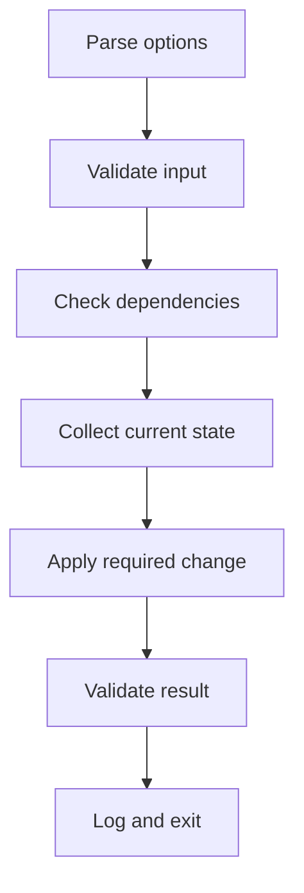

# Advanced Bash Automation

**Package:** 02 — Bash Scripting Interview Preparation  
**Level:** Intermediate to Advanced

---

## 1. Production Script Design

A maintainable operational script normally includes:

```text
Purpose and usage
Configuration and defaults
Dependency checks
Input validation
Small functions
Logging
Error handling
Cleanup
Main workflow
Meaningful exit status
Tests and documentation
```



---

## 2. Arrays

### Indexed arrays

```bash
services=(nginx sshd docker)

printf 'First: %s\n' "${services[0]}"
printf 'Count: %d\n' "${#services[@]}"

for service in "${services[@]}"; do
    printf '%s\n' "$service"
done
```

### Append

```bash
services+=(containerd)
```

### Associative arrays

```bash
declare -A ports=(
    [ssh]=22
    [http]=80
    [https]=443
)

for name in "${!ports[@]}"; do
    printf '%s=%s\n' "$name" "${ports[$name]}"
done
```

Quote array expansions. `"${array[@]}"` preserves each element as a separate argument.

---

## 3. String and Parameter Operations

```bash
path="/var/log/nginx/access.log"

printf 'Basename: %s\n' "${path##*/}"
printf 'Directory: %s\n' "${path%/*}"
printf 'Replace: %s\n' "${path/access/error}"
printf 'Length: %d\n' "${#path}"
```

| Expansion | Purpose |
|---|---|
| `${var#pattern}` | Remove shortest prefix match |
| `${var##pattern}` | Remove longest prefix match |
| `${var%pattern}` | Remove shortest suffix match |
| `${var%%pattern}` | Remove longest suffix match |
| `${var/pattern/replacement}` | Replace first match |

---

## 4. Command-Line Interfaces with `getopts`

```bash
usage() {
    printf 'Usage: %s [-v] [-t threshold] [-o output]\n' "${0##*/}"
}

verbose=false
threshold=80
output=""

while getopts ':vt:o:h' option; do
    case "$option" in
        v) verbose=true ;;
        t) threshold="$OPTARG" ;;
        o) output="$OPTARG" ;;
        h) usage; exit 0 ;;
        :) printf 'Option -%s requires an argument\n' "$OPTARG" >&2; exit 2 ;;
        \?) printf 'Unknown option: -%s\n' "$OPTARG" >&2; exit 2 ;;
    esac
done
shift "$((OPTIND - 1))"
```

Validate option values after parsing:

```bash
if [[ ! "$threshold" =~ ^[0-9]+$ ]] || ((threshold < 1 || threshold > 100)); then
    printf 'Threshold must be an integer from 1 to 100\n' >&2
    exit 2
fi
```

---

## 5. Strict Mode and Tradeoffs

Common defensive settings:

```bash
set -Eeuo pipefail
```

| Setting | Effect |
|---|---|
| `-e` | Exit on certain unhandled command failures |
| `-E` | Inherit ERR traps in functions/subshell contexts |
| `-u` | Treat unset variables as errors |
| `pipefail` | Pipeline fails if any component fails |

### Important limitation

`set -e` has contextual exceptions and can surprise maintainers. Commands used as conditions, parts of logical lists, or other contexts behave differently. It is not a replacement for explicit validation.

Prefer clear handling for expected failure:

```bash
if ! output="$(command 2>&1)"; then
    printf 'Command failed: %s\n' "$output" >&2
    return 1
fi
```

### Arithmetic trap

```bash
count=0
((count++))
```

The expression evaluates to the old value, zero, producing status 1. With `set -e`, this can terminate the script. Safer:

```bash
((count += 1))
```

---

## 6. Traps and Cleanup

### Temporary directory

```bash
temporary_directory=""

cleanup() {
    local status=$?
    if [[ -n "$temporary_directory" && -d "$temporary_directory" ]]; then
        rm -rf -- "$temporary_directory"
    fi
    exit "$status"
}

trap cleanup EXIT
trap 'exit 130' INT
trap 'exit 143' TERM

temporary_directory="$(mktemp -d)"
```

Before using `rm -rf`, validate that the path is non-empty, expected, and was created by the script. Prefer `mktemp` rather than predictable filenames.

### ERR trap

```bash
on_error() {
    local status=$?
    local line=$1
    printf 'Error: status=%d line=%d\n' "$status" "$line" >&2
}

trap 'on_error "$LINENO"' ERR
```

Traps can add context but should remain simple and avoid hiding the original status.

---

## 7. Logging

```bash
timestamp() {
    date --iso-8601=seconds
}

log() {
    local level="$1"
    shift
    printf '%s [%s] %s\n' "$(timestamp)" "$level" "$*"
}

log INFO "Starting health check"
log ERROR "Configuration missing" >&2
```

### Logging principles

- Include time, level, host or component, and useful context.
- Send data output and diagnostic logs to different streams.
- Never log passwords, private keys, tokens, or sensitive payloads.
- Use stable messages that monitoring can recognize.
- Consider structured JSON only when downstream tools require it and escaping is reliable.

---

## 8. Idempotency

An idempotent script can be executed repeatedly without creating unintended additional changes.

### Non-idempotent

```bash
printf 'server 10.0.0.10\n' >> /etc/hosts
```

Every run adds a duplicate.

### Idempotent pattern

```bash
entry="10.0.0.10 server"
if ! grep -Fqx -- "$entry" /etc/hosts; then
    printf '%s\n' "$entry" | sudo tee -a /etc/hosts >/dev/null
fi
```

For configuration files, consider:

1. Read current state.
2. Decide whether a change is required.
3. Back up or stage safely.
4. Apply the minimal change.
5. Validate syntax.
6. Reload only when content changed.
7. Confirm desired state.

---

## 9. Safe File Updates

Avoid partially rewriting an important file.

```bash
update_config() {
    local source_file="$1"
    local target_file="$2"
    local temporary_file

    temporary_file="$(mktemp "${target_file}.tmp.XXXXXX")" || return 1
    trap 'rm -f -- "$temporary_file"' RETURN

    generate_config > "$temporary_file" || return 1
    validate_config "$temporary_file" || return 1
    install -m 0644 "$temporary_file" "$target_file" || return 1
}
```

For production, preserve ownership, permissions, backups, atomicity, and security context according to the application and change procedure.

---

## 10. Dependency and Privilege Checks

```bash
require_command() {
    local command_name="$1"
    command -v "$command_name" >/dev/null 2>&1 || {
        printf 'Required command not found: %s\n' "$command_name" >&2
        return 1
    }
}

require_root() {
    if ((EUID != 0)); then
        printf 'This operation requires root privileges\n' >&2
        return 1
    fi
}
```

Require elevated privileges only for functions that need them. Do not run the entire script as root unnecessarily.

---

## 11. Concurrency and Locking

Multiple copies can corrupt output or duplicate work.

Where `flock` is available:

```bash
exec 9>/run/lock/my-script.lock
if ! flock -n 9; then
    printf 'Another instance is running\n' >&2
    exit 75
fi
```

Choose a lock location with appropriate permissions. Ensure the mechanism handles process termination correctly.

---

## 12. Security

### Avoid command injection

Do not build commands as strings from untrusted input and execute them with `eval`.

Unsafe:

```bash
command="grep $user_input file"
eval "$command"
```

Safer:

```bash
grep -F -- "$user_input" file
```

### Secrets

Avoid secrets in:

- Source code
- Command-line arguments visible through process listings
- Shell history
- Debug tracing
- Logs
- World-readable files

Use an approved secret store, restricted file descriptor, protected environment injection, or platform mechanism.

### Temporary files

Use `mktemp`, restrictive permissions, and cleanup traps.

```bash
umask 077
secret_file="$(mktemp)"
```

### Globs and option injection

Quote variables and use `--` where supported:

```bash
rm -- "$file"
grep -F -- "$pattern" "$file"
```

---

## 13. Subshells and Process Substitution

### Subshell

```bash
(cd /var/log && find . -type f -name '*.log')
```

Directory and variable changes inside do not affect the parent shell.

### Pipeline loop problem

```bash
count=0
printf '%s\n' a b c | while read -r item; do
    ((count += 1))
done
printf '%s\n' "$count"
```

In many Bash configurations, the loop runs in a subshell, so the parent `count` remains unchanged.

Use process substitution:

```bash
count=0
while read -r item; do
    ((count += 1))
done < <(printf '%s\n' a b c)
printf '%s\n' "$count"
```

---

## 14. Debugging Workflow

### Syntax

```bash
bash -n script.sh
```

### Trace execution

```bash
bash -x script.sh
```

Custom trace context:

```bash
export PS4='+ ${BASH_SOURCE}:${LINENO}:${FUNCNAME[0]:-main}: '
bash -x script.sh
```

Disable tracing around secrets:

```bash
set +x
# sensitive operation
set -x
```

Prefer not to enable global trace in environments handling secrets.

### ShellCheck

```bash
shellcheck script.sh
```

ShellCheck identifies common quoting, expansion, portability, and logic issues. Review each finding; do not suppress warnings without documenting why.

### Debug order

1. Reproduce with known inputs.
2. Check exact interpreter and line endings.
3. Run syntax validation.
4. Capture stdout, stderr, and exit code.
5. Trace the smallest failing section.
6. Inspect variable values without exposing secrets.
7. Test the fix on normal, boundary, and failure inputs.

---

## 15. Testing Strategy

Test categories:

- Valid input
- Missing input
- Empty input
- Invalid type or format
- Filenames with spaces and leading dashes
- Missing dependency
- Permission failure
- Command failure
- Interrupted execution
- Repeated execution
- Concurrent execution

Example test helper:

```bash
assert_equals() {
    local expected="$1"
    local actual="$2"
    local message="$3"

    if [[ "$expected" == "$actual" ]]; then
        printf 'PASS: %s\n' "$message"
    else
        printf 'FAIL: %s expected=%q actual=%q\n' "$message" "$expected" "$actual" >&2
        return 1
    fi
}
```

For larger Bash projects, consider a test framework such as Bats if allowed by the project.

---

## 16. Cron and systemd Environments

A scheduled script may have:

- Minimal PATH
- Different working directory
- Different user and groups
- No interactive shell initialization
- Different home directory
- Missing credentials or agent
- No terminal

Use absolute paths, explicit configuration, logging, and correct permissions.

Systemd service example:

```ini
[Unit]
Description=Linux Health Report

[Service]
Type=oneshot
ExecStart=/usr/local/bin/linux-health-report.sh --quiet
User=monitoring
```

Timer example:

```ini
[Unit]
Description=Run Linux Health Report Every Five Minutes

[Timer]
OnBootSec=2min
OnUnitActiveSec=5min
Persistent=true

[Install]
WantedBy=timers.target
```

---

## 17. Exit-Code Design

Document exit codes:

| Code | Meaning |
|---:|---|
| 0 | Healthy/success |
| 1 | General runtime failure |
| 2 | Invalid usage or input |
| 3 | Warning threshold exceeded |
| 4 | Critical threshold exceeded |
| 69 | Required service unavailable |
| 75 | Temporary failure or lock held |

Choose codes that fit the consuming automation and document them. Avoid returning a success status after reporting a failure.

---

## 18. Code Review Checklist

- [ ] Purpose, usage, author, and assumptions are documented.
- [ ] Interpreter is correct.
- [ ] Inputs and option values are validated.
- [ ] Variable and array expansions are quoted.
- [ ] External dependencies are checked.
- [ ] Expected failures are handled explicitly.
- [ ] Temporary resources are safely created and cleaned.
- [ ] Script is idempotent where it changes state.
- [ ] Secrets are absent from code, logs, arguments, and tracing.
- [ ] Privileges are minimized.
- [ ] Exit statuses are meaningful.
- [ ] Syntax check and ShellCheck pass.
- [ ] Normal, boundary, failure, repeated, and interrupted runs are tested.

---

## 19. Advanced Interview Questions

1. What problems can `set -e` cause?
2. How does `pipefail` change a pipeline's status?
3. Why can a variable modified inside a piped `while` loop be lost?
4. How do you design a cleanup trap without hiding the original status?
5. What makes an administrative script idempotent?
6. How do you safely update a configuration file?
7. How do you prevent concurrent script instances?
8. How do you separate function data output from logs?
9. Why is `eval` dangerous with user-controlled input?
10. How do you test failure and interruption paths?

