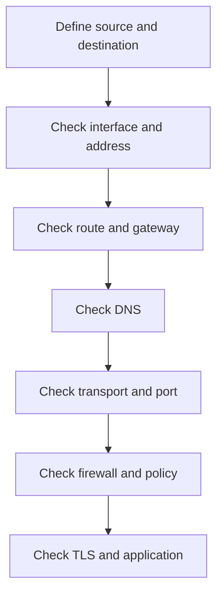

# Networking and Advanced Networking Interview Preparation

This package develops the networking knowledge, command-line diagnostic skills, architecture reasoning, and troubleshooting method required for Linux System Administrator, DevOps, Cloud, Platform Engineering, and SRE interviews.

Networking connects every layer of modern infrastructure. A strong engineer must be able to move from a user symptom to DNS, routing, transport, firewall, TLS, proxy, load-balancer, application, and cloud-network evidence without guessing.

---

## Package Objectives

After completing this package, I should be able to:

- Explain the OSI and TCP/IP models using real protocols.
- Understand MAC addresses, ARP/neighbor discovery, IP addressing, CIDR, and subnetting.
- Identify network, usable-host, and broadcast addresses in IPv4 subnets.
- Explain routing tables, default gateways, longest-prefix matching, and NAT.
- Compare TCP and UDP and explain the TCP handshake and connection states.
- Explain DNS resolution, caching, record types, and failure modes.
- Diagnose interfaces, addresses, routes, sockets, ports, and packets on Linux.
- Explain HTTP, HTTPS, TLS certificates, proxies, reverse proxies, and load balancers.
- Understand firewalls, security groups, network ACLs, and network policies.
- Explain VPNs, VPC peering, transit networking, private endpoints, and hybrid connectivity.
- Troubleshoot connectivity through a repeatable layered isolation method.
- Answer technical, architecture, and scenario-based networking interview questions.

---

## Troubleshooting Method



For every incident, identify:

- Source host and address
- Destination name, address, and port
- Protocol and expected path
- Exact error and timing
- Recent changes
- Where packets stop or responses change
- Safe mitigation and validation

---

## Package Structure

```text
03-Networking/
├── README.md
├── Study-Notes/
│   ├── 01-Networking-Fundamentals.md
│   └── 02-Advanced-Networking.md
├── Tools/
│   ├── README.md
│   └── network-diagnostic.sh
├── Hands-on-Labs/
│   └── Networking-Hands-on-Labs.md
├── Troubleshooting-Scenarios/
│   └── Networking-Troubleshooting-Scenarios.md
├── Interview-Questions/
│   └── Networking-Interview-Questions-and-Answers.md
├── MCQ-Quizzes/
│   └── Networking-Interview-MCQ-Quiz.html
├── Cheat-Sheets/
│   └── Networking-Interview-Cheat-Sheet.md
└── Mock-Interview/
    └── Networking-Mock-Interview.md
```

---

## Study Modules

### Module 1 — Networking Fundamentals

- OSI and TCP/IP models
- Frames, packets, segments, and encapsulation
- Ethernet, MAC addresses, ARP, and switching
- IPv4, CIDR, subnetting, private ranges, loopback, and link-local addresses
- Routes, gateways, ICMP, TCP, UDP, sockets, and ports
- DNS, DHCP, and essential Linux commands

[Open Networking Fundamentals](Study-Notes/01-Networking-Fundamentals.md)

### Module 2 — Advanced Networking

- NAT and connection tracking
- Firewalls and stateful/stateless filtering
- HTTP, HTTPS, TLS, proxies, and reverse proxies
- Load balancing, health checks, sessions, and failure behavior
- VPN, peering, transit networking, hybrid routing, and private endpoints
- Kubernetes and container networking concepts
- Packet capture and advanced troubleshooting

[Open Advanced Networking](Study-Notes/02-Advanced-Networking.md)

---

## Required Diagnostic Project

The package includes a read-only network diagnostic tool that:

- Accepts hostname/IP, port, protocol, and timeout options.
- Shows local interface and routing context.
- Performs system resolver and optional DNS detail checks.
- Tests ICMP when permitted.
- Tests TCP or UDP port connectivity using available tools.
- Performs an optional HTTP/HTTPS request.
- Records clear PASS, WARN, and FAIL results.
- Returns meaningful exit statuses.

[Open Network Diagnostic Tool](Tools/network-diagnostic.sh)

---

## Core Interview Domains

| Domain | Required knowledge |
|---|---|
| Models | OSI, TCP/IP, encapsulation, protocol placement |
| Layer 2 | Ethernet, MAC, ARP, switches, VLAN concepts |
| Layer 3 | IPv4, IPv6 basics, CIDR, subnetting, ICMP, routing |
| Layer 4 | TCP, UDP, handshake, states, ports, sockets |
| Name services | DNS resolution, record types, caching, TTL, failure |
| Address assignment | DHCP discovery, lease, gateway, DNS options |
| Security | Host firewall, SG, NACL, NetworkPolicy, least privilege |
| Web | HTTP methods/status, headers, proxying, TLS certificates |
| Distribution | Load balancing, algorithms, health checks, sessions |
| Connectivity | NAT, VPN, peering, transit, hybrid, private endpoints |
| Linux tools | `ip`, `ss`, `ping`, `dig`, `curl`, `nc`, `traceroute`, `tcpdump` |
| Troubleshooting | Evidence, packet path, isolation, mitigation, prevention |

---

## Required Hands-on Labs

1. Local interface, address, and route inventory
2. IPv4 CIDR and subnet calculations
3. ARP/neighbor table and local connectivity
4. DNS resolution and record inspection
5. TCP listening socket and client connection
6. UDP behavior and packet observation
7. Route selection and traceroute analysis
8. Host firewall rule validation in a disposable lab
9. HTTP headers, redirects, and status codes
10. TLS certificate and handshake inspection
11. Nginx reverse proxy and health endpoint
12. End-to-end failure-injection incident

---

## Required Troubleshooting Scenarios

- Interface is down or missing an address
- Default route is absent
- Host works by IP but not hostname
- DNS resolves to the wrong address
- Ping fails but the application works
- Connection refused
- Connection timeout
- Service listens only on loopback
- Firewall permits one direction but return traffic fails
- TLS certificate expired or hostname mismatch
- Reverse proxy returns 502
- Load balancer marks targets unhealthy
- VPC peering route is missing or CIDRs overlap
- MTU/fragmentation causes intermittent failures
- Packets arrive at the server but application does not respond

---

## Two-Week Networking Plan

### Week 1 — Fundamentals

| Day | Focus | Deliverable |
|---:|---|---|
| 1 | Models, encapsulation, Ethernet, MAC, ARP | Protocol map |
| 2 | IPv4, CIDR, private ranges, subnetting | Subnet worksheet |
| 3 | Routing, gateways, ICMP | Route-analysis lab |
| 4 | TCP, UDP, sockets, and ports | Socket lab |
| 5 | DNS and DHCP | Resolution lab |
| 6 | Linux diagnostic commands | Evidence report |
| 7 | Assessment | Foundation quiz |

### Week 2 — Advanced Networking

| Day | Focus | Deliverable |
|---:|---|---|
| 1 | NAT, firewalls, and state | Policy lab |
| 2 | HTTP, TLS, proxy, and reverse proxy | Nginx lab |
| 3 | Load balancing and health checks | Architecture explanation |
| 4 | VPN, peering, transit, and hybrid routing | Cloud diagram |
| 5 | Packet capture and failure injection | Incident report |
| 6 | Scenario interview practice | Mock technical round |
| 7 | Final review | Networking readiness assessment |

---

## Package Deliverables

| Deliverable | File |
|---|---|
| Networking foundation notes | [01-Networking-Fundamentals.md](Study-Notes/01-Networking-Fundamentals.md) |
| Advanced networking notes | [02-Advanced-Networking.md](Study-Notes/02-Advanced-Networking.md) |
| Diagnostic tool guide | [Tools/README.md](Tools/README.md) |
| Network diagnostic script | [network-diagnostic.sh](Tools/network-diagnostic.sh) |
| Twelve hands-on labs | [Networking-Hands-on-Labs.md](Hands-on-Labs/Networking-Hands-on-Labs.md) |
| Fifteen troubleshooting scenarios | [Networking-Troubleshooting-Scenarios.md](Troubleshooting-Scenarios/Networking-Troubleshooting-Scenarios.md) |
| Forty interview questions and answers | [Networking-Interview-Questions-and-Answers.md](Interview-Questions/Networking-Interview-Questions-and-Answers.md) |
| Networking cheat sheet | [Networking-Interview-Cheat-Sheet.md](Cheat-Sheets/Networking-Interview-Cheat-Sheet.md) |
| Interactive 25-question quiz | [Networking-Interview-MCQ-Quiz.html](MCQ-Quizzes/Networking-Interview-MCQ-Quiz.html) |
| Sixty-minute mock interview | [Networking-Mock-Interview.md](Mock-Interview/Networking-Mock-Interview.md) |

---

## Progress Tracker

| Deliverable | Status |
|---|---|
| Package README | Complete |
| Foundation notes | Complete |
| Advanced notes | Complete |
| Diagnostic tool | Complete |
| Hands-on labs | Complete |
| Troubleshooting scenarios | Complete |
| Interview questions | Complete |
| Cheat sheet | Complete |
| Interactive MCQ quiz | Complete |
| Mock interview | Complete |
| Final assessment | Ready to Attempt |

---

## Interview-Ready Checklist

- [ ] I can explain packet flow through OSI/TCP-IP layers.
- [ ] I can calculate IPv4 subnets and usable ranges.
- [ ] I can distinguish switching, routing, DNS, and transport failures.
- [ ] I can interpret interface, route, socket, and resolver output.
- [ ] I can explain the TCP handshake and connection states.
- [ ] I can compare TCP and UDP using real workloads.
- [ ] I can explain NAT, stateful firewalls, and return traffic.
- [ ] I can diagnose HTTP, TLS, proxy, and load-balancer failures.
- [ ] I can explain VPN, peering, transit, and private connectivity.
- [ ] I can use packet capture to confirm where communication fails.
- [ ] I can present a layered troubleshooting answer without guessing.
- [ ] I can complete the timed mock interview confidently.

---

## Author

**Muhammad Khalid Khan**  
Linux System Administrator | DevOps | AWS | Automation  
GitHub: [krmaryum](https://github.com/krmaryum)

