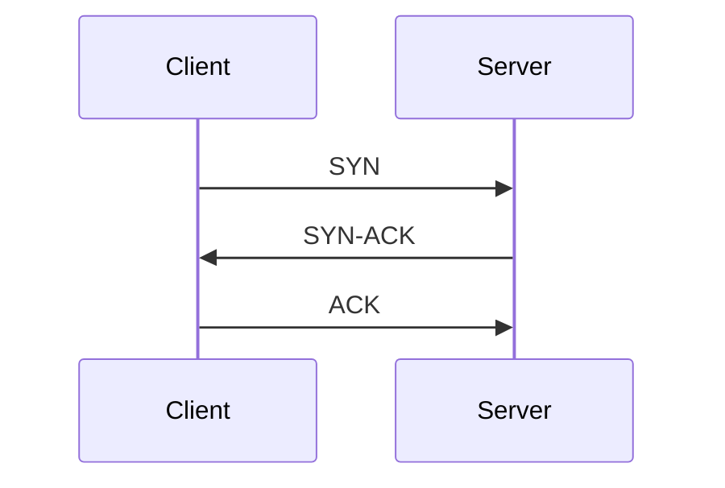

# Networking Fundamentals

**Package:** 03 — Networking and Advanced Networking  
**Level:** Foundation to Intermediate

---

## 1. What Is a Network?

A network is a group of devices that exchange data through agreed protocols. Communication requires a source, destination, addressing, a path, a transport method, and an application protocol.


## Core questions for every connection

- Who is the source?
- What is the destination name and IP?
- Which protocol and port are expected?
- Which route will be selected?
- Which devices and policies are in the path?
- How will return traffic reach the source?

---

## 2. OSI and TCP/IP Models

| OSI layer | Purpose | Examples |
|---:|---|---|
| 7 Application | User/application protocols | HTTP, DNS, SSH, SMTP |
| 6 Presentation | Format, encoding, encryption | TLS representation concepts |
| 5 Session | Dialog/session management | Session concepts |
| 4 Transport | End-to-end delivery | TCP, UDP, ports |
| 3 Network | Logical addressing and routing | IPv4, IPv6, ICMP |
| 2 Data Link | Local-link delivery | Ethernet, MAC, VLAN, ARP interaction |
| 1 Physical | Signals and media | Copper, fiber, radio |

TCP/IP is commonly expressed as application, transport, internet, and link layers.

### Encapsulation

```text
Application data
→ TCP segment or UDP datagram
→ IP packet
→ Ethernet frame
→ Bits/signals
```

The receiver removes headers in reverse order.

### Data-unit terminology

| Layer | Common unit |
|---|---|
| Application | Data/message |
| Transport | TCP segment / UDP datagram |
| Network | Packet |
| Data link | Frame |
| Physical | Bits |

---

## 3. Ethernet, MAC, Switching, and ARP

### MAC address

A MAC address identifies a network interface at the local-link layer. Ethernet switches learn which MAC addresses are reachable through which ports.

### ARP

IPv4 ARP maps an on-link IP address to a MAC address.

```bash
ip neigh
arp -n 2>/dev/null || true
```

When a destination is outside the local subnet, the host normally resolves the default gateway's MAC—not the remote server's MAC.

### Switch versus router

- A switch forwards frames within a Layer 2 network using MAC information.
- A router forwards packets between IP networks using a routing table.

### VLAN concept

A VLAN creates a logical Layer 2 broadcast domain. Communication between VLANs requires Layer 3 routing and appropriate policy.

---

## 4. IPv4 Addressing

An IPv4 address contains 32 bits. CIDR notation indicates how many leading bits belong to the network prefix.

```text
10.20.30.45/24
```

For `/24`:

- Network: `10.20.30.0`
- Typical usable hosts: `10.20.30.1`–`10.20.30.254`
- Broadcast: `10.20.30.255`
- Total addresses: 256

### Common prefixes

| Prefix | Mask | Total IPv4 addresses |
|---:|---|---:|
| `/8` | `255.0.0.0` | 16,777,216 |
| `/16` | `255.255.0.0` | 65,536 |
| `/24` | `255.255.255.0` | 256 |
| `/25` | `255.255.255.128` | 128 |
| `/26` | `255.255.255.192` | 64 |
| `/27` | `255.255.255.224` | 32 |
| `/28` | `255.255.255.240` | 16 |
| `/29` | `255.255.255.248` | 8 |
| `/30` | `255.255.255.252` | 4 |
| `/32` | `255.255.255.255` | 1 |

Traditional usable-host calculation for ordinary IPv4 subnets:

```text
2^(32-prefix) - 2
```

Platform-specific reserved addresses can reduce usable counts further; for example, cloud providers reserve addresses within subnets.

### Private IPv4 ranges

| Range | CIDR |
|---|---|
| `10.0.0.0`–`10.255.255.255` | `10.0.0.0/8` |
| `172.16.0.0`–`172.31.255.255` | `172.16.0.0/12` |
| `192.168.0.0`–`192.168.255.255` | `192.168.0.0/16` |

Private addresses are not directly routed across the public Internet.

### Special addresses

| Range | Purpose |
|---|---|
| `127.0.0.0/8` | IPv4 loopback |
| `169.254.0.0/16` | IPv4 link-local/APIPA |
| `0.0.0.0` | Unspecified address; listening can mean all IPv4 interfaces |
| `255.255.255.255` | Limited broadcast |

---

## 5. Subnetting Method

Example: `192.168.10.70/26`

1. `/26` leaves 6 host bits.
2. Block size is `2^6 = 64` addresses.
3. Subnets begin at `.0`, `.64`, `.128`, and `.192`.
4. `.70` falls inside `.64`–`.127`.
5. Network is `192.168.10.64`.
6. Broadcast is `192.168.10.127`.
7. Traditional usable range is `.65`–`.126`.

### Interview practice

Calculate:

- `10.20.15.200/27`
- `172.16.8.33/28`
- `192.168.5.130/25`

Show network, broadcast, first/last typical host, and total addresses.

---

## 6. IPv6 Basics

IPv6 uses 128-bit addresses and hexadecimal notation.

| Prefix/range | Purpose |
|---|---|
| `::1/128` | Loopback |
| `fe80::/10` | Link-local |
| `2000::/3` | Global unicast allocation space |
| `fc00::/7` | Unique local addresses |

IPv6 uses Neighbor Discovery rather than ARP. Broadcast is replaced by multicast and other mechanisms. A typical LAN prefix is `/64`.

```bash
ip -6 address
ip -6 route
ip -6 neigh
```

---

## 7. Routing and Gateways

A routing table decides the next hop and interface for a destination.

```bash
ip route
ip route get 8.8.8.8
```

Example:

```text
default via 192.168.1.1 dev eth0
192.168.1.0/24 dev eth0 proto kernel src 192.168.1.20
```

### Longest-prefix match

When several routes match, the most specific prefix normally wins.

```text
10.0.0.0/8
10.20.0.0/16
10.20.30.0/24  ← selected for 10.20.30.50
```

The default route (`0.0.0.0/0`) is used when no more-specific route exists.

### Return path

Forward connectivity is not enough. The destination must have a valid return route, and stateful devices must recognize the connection.

---

## 8. ICMP

ICMP communicates network control and error information. `ping` commonly uses ICMP echo requests and replies.

```bash
ping -c 4 8.8.8.8
```

Ping failure does not prove the application is down because ICMP can be filtered while TCP/UDP traffic remains allowed. Test the actual protocol and port.

Traceroute uses TTL/hop-limit behavior to reveal path hops:

```bash
traceroute example.com
tracepath example.com
```

Asterisks can mean filtering or rate limiting, not necessarily path failure.

---

## 9. TCP and UDP

### TCP

TCP is connection-oriented and provides ordered, reliable byte delivery, flow control, and congestion control.



### UDP

UDP is connectionless and does not provide TCP's delivery, ordering, or retransmission guarantees. Applications can add their own reliability behavior.

### Comparison

| Area | TCP | UDP |
|---|---|---|
| Connection | Established state | No TCP-style connection |
| Reliability | Built in | Application-dependent |
| Ordering | Preserved | Not guaranteed |
| Overhead | Higher | Lower |
| Examples | SSH, HTTPS, database sessions | DNS queries, streaming, telemetry |

DNS commonly uses UDP for ordinary queries and TCP in cases such as larger responses and zone transfer.

---

## 10. Ports and Sockets

A socket endpoint combines protocol, IP address, and port.

```bash
ss -lntup
ss -tan
```

Common ports:

| Service | Port/protocol |
|---|---|
| SSH | 22/TCP |
| DNS | 53/UDP and TCP |
| HTTP | 80/TCP |
| HTTPS | 443/TCP; modern HTTP can also use UDP-based QUIC |
| NTP | 123/UDP |
| SMTP | 25/TCP |
| PostgreSQL | 5432/TCP |
| MySQL | 3306/TCP |

### Bind addresses

- `127.0.0.1:8080`: local IPv4 clients only
- `0.0.0.0:8080`: all IPv4 interfaces
- `[::]:8080`: IPv6 wildcard; dual-stack behavior depends on system settings

---

## 11. DNS

DNS translates names and provides other service information.

### Common record types

| Record | Purpose |
|---|---|
| A | Name to IPv4 address |
| AAAA | Name to IPv6 address |
| CNAME | Alias to another name |
| MX | Mail exchanger |
| NS | Authoritative name server |
| TXT | Text/policy/verification data |
| PTR | Reverse lookup |
| SOA | Zone authority metadata |

### Resolution path

```text
Application → system resolver → local cache/configuration → recursive resolver
→ root/TLD/authoritative hierarchy as needed → cached answer
```

### Linux checks

```bash
getent hosts example.com
dig example.com
dig +short example.com
dig example.com A
dig example.com AAAA
resolvectl status 2>/dev/null || true
cat /etc/resolv.conf
```

`getent` tests the system name-service path, including configured sources. `dig` performs DNS-specific queries.

### TTL

TTL controls how long a result may be cached. A DNS change can appear inconsistent until old cached records expire.

---

## 12. DHCP

DHCP dynamically provides settings such as:

- IP address and prefix
- Default gateway
- DNS resolver
- Lease duration
- Other network options

Common IPv4 flow:

```text
Discover → Offer → Request → Acknowledge
```

A `169.254.x.x` address can indicate that a client failed to obtain an expected IPv4 DHCP lease.

---

## 13. Essential Linux Commands

```bash
ip -br link
ip -br address
ip route
ip route get DESTINATION
ip neigh
ss -lntup
ss -s
getent hosts NAME
dig NAME
ping -c 4 HOST
traceroute HOST
curl -v URL
nc -vz HOST PORT
tcpdump -ni any host HOST
```

Legacy commands such as `ifconfig`, `route`, and `netstat` may exist, but modern Linux administration commonly uses `ip` and `ss`.

---

## 14. Foundation Troubleshooting Order

1. Confirm source, destination, protocol, and exact error.
2. Check local link state and assigned address.
3. Check subnet and route selection.
4. Check gateway and path.
5. Check name resolution separately.
6. Check the actual port and protocol.
7. Check local and intermediate policy.
8. Check application logs and response.

---

## 15. Foundation Checklist

- [ ] I can map common protocols to OSI/TCP-IP layers.
- [ ] I can explain frames, packets, segments, and encapsulation.
- [ ] I can explain MAC, ARP, switching, and routing.
- [ ] I know private, loopback, and link-local IPv4 ranges.
- [ ] I can calculate common IPv4 subnets.
- [ ] I understand IPv6 addressing basics.
- [ ] I can interpret a Linux routing table.
- [ ] I can compare TCP and UDP.
- [ ] I can explain sockets and listening addresses.
- [ ] I can troubleshoot DNS with system and DNS-specific tools.

