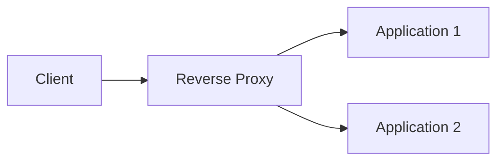

# Advanced Networking

**Package:** 03 — Networking and Advanced Networking  
**Level:** Intermediate to Advanced

---

## 1. NAT and Connection Tracking

Network Address Translation changes address and sometimes port information as traffic crosses a device.

| Type | Concept |
|---|---|
| Source NAT | Changes source address, commonly for outbound access |
| Destination NAT | Changes destination address, commonly for publishing a service |
| PAT/NAPT | Translates ports so many connections share an address |

### Outbound example

```text
Private host 10.0.1.20:45000
→ NAT public address 203.0.113.10:61001
→ Internet service 198.51.100.25:443
```

The NAT device tracks state so the response can be translated back to the private host.

NAT is not a substitute for authentication, encryption, or complete firewall policy.

---

## 2. Stateful and Stateless Filtering

### Stateful

A stateful firewall tracks established connections and can permit return traffic based on connection state.

### Stateless

A stateless filter evaluates packets independently. Both directions may need explicit rules.

### Common controls

| Control | Typical scope |
|---|---|
| Host firewall | One operating system |
| Cloud security group | Resource/interface policy; commonly stateful |
| Cloud network ACL | Subnet boundary; commonly stateless |
| Kubernetes NetworkPolicy | Pod traffic, dependent on network plugin |

Troubleshooting must examine source, destination, protocol, port, direction, rule order, state, and return traffic.

Linux inspection examples:

```bash
sudo nft list ruleset
sudo iptables -S
sudo firewall-cmd --list-all
sudo ufw status verbose
```

Use the tool appropriate to the distribution and configured firewall stack.

---

## 3. MTU, MSS, and Fragmentation

MTU is the largest Layer 3 packet size carried without fragmentation on an interface/path segment. Ethernet commonly uses MTU 1500, but tunnels add headers and reduce effective payload capacity.

Symptoms of MTU problems can include:

- Small requests work, large transfers hang
- TLS handshake or VPN traffic fails intermittently
- Certain destinations fail across a tunnel

```bash
ip link
tracepath destination
ping -M do -s 1472 destination
```

For IPv4 ICMP plus IP headers, 1472 bytes of payload often tests a 1500-byte path, but headers and IPv6 differ. Do not block all ICMP blindly; path MTU discovery depends on control messages.

---

## 4. HTTP Fundamentals

HTTP is an application protocol using request/response messages.

### Common methods

| Method | Typical use |
|---|---|
| GET | Retrieve representation |
| POST | Submit/create/process data |
| PUT | Replace/create at known URI |
| PATCH | Partial modification |
| DELETE | Remove a resource |
| HEAD | Headers without response body |
| OPTIONS | Capabilities and CORS-related behavior |

### Status classes

| Class | Meaning |
|---:|---|
| 1xx | Informational |
| 2xx | Successful |
| 3xx | Redirection |
| 4xx | Client-side request/auth/resource issue |
| 5xx | Server/proxy/upstream failure |

```bash
curl -I https://example.com
curl -v https://example.com
curl -sS -o /dev/null -w '%{http_code}\n' https://example.com
```

---

## 5. TLS and HTTPS

TLS provides authentication, confidentiality, and integrity for application traffic.

### Certificate checks

- Subject Alternative Name matches requested hostname
- Certificate is within validity period
- Issuer chain reaches a trusted CA
- Server sends required intermediate certificates
- Client and server share supported protocol/cipher choices

```bash
openssl s_client -connect example.com:443 -servername example.com </dev/null
curl -v https://example.com
```

### Common TLS failures

- Expired or not-yet-valid certificate
- Hostname mismatch
- Missing intermediate certificate
- Untrusted private CA
- Incorrect system time
- TLS-version/cipher incompatibility
- Proxy or load balancer presenting the wrong certificate

Do not disable certificate verification as a production fix.

---

## 6. Forward Proxy and Reverse Proxy

### Forward proxy

Acts on behalf of clients accessing other services. It can enforce outbound policy, caching, and inspection.

### Reverse proxy

Acts on behalf of backend servers. It can terminate TLS, route by hostname/path, balance traffic, cache content, and hide backend topology.



### 502 versus 504

- `502 Bad Gateway`: proxy received an invalid/failed upstream response.
- `504 Gateway Timeout`: proxy did not receive an upstream response in time.

Check proxy logs, upstream name resolution, route, port, health, TLS mode, timeouts, and application logs.

---

## 7. Load Balancing

A load balancer distributes requests across healthy targets.

### Algorithms

- Round robin
- Weighted round robin
- Least connections
- Hash-based distribution
- Latency or resource-aware strategies

### Health checks

A useful health check verifies the dependency level needed to serve traffic without being overly expensive. It must use the correct protocol, port, hostname, path, expected status, timeout, and thresholds.

### Session persistence

Sticky sessions keep a client associated with a target. They may be required for stateful applications but can reduce even distribution and resilience. External session storage or stateless design is often more scalable.

### Layer 4 versus Layer 7

| Area | Layer 4 | Layer 7 |
|---|---|---|
| Decision data | IP, port, transport | HTTP host, path, headers, cookies |
| Protocol awareness | Lower | Application-aware |
| TLS handling | Pass-through or termination depending design | Commonly terminates/inspects HTTP/TLS |

---

## 8. DNS for Highly Available Services

DNS can return multiple records, use weighted/latency/failover policies, and direct users toward load balancers. DNS alone does not guarantee instant failover because clients and resolvers cache results according to TTL and local behavior.

During a change:

1. Lower TTL in advance if appropriate.
2. Validate new targets.
3. Change records.
4. Monitor old and new paths.
5. Keep rollback capacity until caches expire.

---

## 9. VPN and Tunneling

A VPN creates protected connectivity across another network.

Key concepts:

- Authentication and encryption
- Tunnel endpoints
- Interesting traffic/routes
- MTU overhead
- Rekeying and lifetime
- Redundant tunnels
- Static versus dynamic routing

Common problems include mismatched routes, overlapping CIDRs, asymmetric paths, MTU issues, expired credentials, and one-sided policy.

---

## 10. Cloud Connectivity Patterns

### VPC peering

Direct private routing between networks. Common constraints include non-transitive behavior and overlapping CIDR limitations.

### Transit networking

A hub connects multiple networks and can centralize routing, inspection, and hybrid connectivity.

### Private endpoint

Provides private access to a service without using its public path, depending on platform/service design.

### Internet and NAT gateways

- An Internet gateway provides a path for appropriately addressed/routed resources.
- A NAT gateway/device provides outbound connectivity for private addresses while preventing unsolicited inbound translation by default design.

### Hybrid connectivity

Site-to-site VPN or dedicated circuits connect on-premises and cloud networks. Design must address route exchange, redundancy, encryption, bandwidth, latency, monitoring, and failover.

---

## 11. Routing Protocol Concepts

### Static routing

Routes are configured manually. It is simple but requires operational updates.

### Dynamic routing

Routers exchange reachability information.

| Protocol | High-level use |
|---|---|
| OSPF | Interior link-state routing |
| BGP | Policy-based routing between autonomous systems and in large/hybrid designs |

BGP chooses paths using policy and attributes, not simply geographic distance. Interviews may focus on ASN, prefixes, advertisements, route preference, and redundancy rather than command-level configuration.

---

## 12. Container and Kubernetes Networking Concepts

- Containers commonly use virtual interfaces, bridges, routing, and NAT.
- Kubernetes gives each Pod an address in the cluster network model.
- Services provide stable virtual access to changing Pods.
- Ingress/Gateway components provide application routing.
- NetworkPolicy controls permitted Pod traffic when supported by the CNI plugin.
- DNS provides service discovery.

Troubleshooting order:

```text
Pod process → Pod address → Service selector/endpoints → Service port/targetPort
→ NetworkPolicy → Ingress/controller → load balancer/DNS/TLS
```

---

## 13. Packet Capture

`tcpdump` observes packets at an interface.

```bash
sudo tcpdump -ni any host 10.0.0.25
sudo tcpdump -ni eth0 tcp port 443
sudo tcpdump -ni any 'host 10.0.0.25 and (port 80 or port 443)'
sudo tcpdump -ni any -w capture.pcap
```

### TCP handshake interpretation

- SYN leaves, no response: path/filter/destination issue
- SYN leaves, RST returns: destination reachable but port rejected/no listener
- SYN/SYN-ACK seen, final ACK absent: return path or client-side filtering
- Handshake completes, app stalls: inspect TLS/application layer

Capture only authorized traffic, protect packet files, and avoid collecting unnecessary sensitive payloads.

---

## 14. Connection States

```bash
ss -tan
```

| State | Meaning |
|---|---|
| LISTEN | Server waiting for connections |
| ESTABLISHED | Bidirectional TCP connection established |
| SYN-SENT | Client sent SYN, awaiting response |
| SYN-RECV | Server received SYN, sent SYN-ACK |
| TIME-WAIT | Closed endpoint retaining state temporarily |
| CLOSE-WAIT | Remote closed; local application has not closed |

Many `CLOSE-WAIT` sockets can indicate an application not closing connections. Many `TIME-WAIT` sockets can be normal with high connection churn; evaluate rate, port exhaustion, and application design.

---

## 15. Advanced Troubleshooting Matrix

| Symptom | First evidence |
|---|---|
| No address | `ip -br address`, DHCP/network service logs |
| No remote network | `ip route`, `ip route get`, gateway test |
| IP works, name fails | `getent hosts`, `dig`, resolver config |
| Refused | `ss -lntup`, local connect, packet RST |
| Timeout | route, firewall, security policy, packet capture |
| Small works, large fails | MTU/path MTU/tunnel overhead |
| TLS error | hostname, date, chain, SNI, cipher/protocol |
| 502 | proxy log and upstream connectivity/response |
| 504 | upstream latency, timeout, route, capacity |
| LB unhealthy | health-check protocol, port, path, status, policy |

---

## 16. Advanced Checklist

- [ ] I can explain NAT and state tracking.
- [ ] I can compare stateful and stateless filters.
- [ ] I can recognize MTU-related symptoms.
- [ ] I can inspect HTTP and TLS behavior.
- [ ] I can compare forward and reverse proxies.
- [ ] I can explain Layer 4 and Layer 7 load balancing.
- [ ] I understand health checks and session persistence.
- [ ] I can compare VPN, peering, transit, and private endpoints.
- [ ] I understand static, OSPF, and BGP at interview level.
- [ ] I can follow Kubernetes traffic from Pod to external client.
- [ ] I can use packet capture to locate connection failure.
- [ ] I can interpret key TCP socket states.

