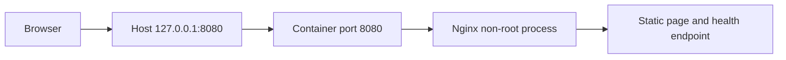

# Dockerized Health Web Project

This project packages a static Nginx website as a production-minded interview demonstration.

## Architecture



## Security and Reliability Features

- Runs as the image's `nginx` user
- Uses an unprivileged container port
- Read-only root filesystem in Compose
- Writable tmpfs only at `/tmp`
- Drops all Linux capabilities
- Sets `no-new-privileges`
- Binds published port to host loopback
- Health check verifies `/health`
- Logs to stdout and stderr
- Restart policy for daemon/runtime recovery

## Build

```bash
docker build -t docker-interview-health-web:1.0 .
```

## Run Directly

```bash
docker run -d \
  --name docker-interview-health-web \
  -p 127.0.0.1:8080:8080 \
  --read-only \
  --tmpfs /tmp:size=16m,mode=1777 \
  --cap-drop ALL \
  --security-opt no-new-privileges:true \
  docker-interview-health-web:1.0
```

## Run with Compose

```bash
docker compose config
docker compose up -d --build
docker compose ps
```

## Validate

```bash
curl -i http://127.0.0.1:8080/
curl -i http://127.0.0.1:8080/health
docker inspect --format '{{.State.Status}} {{.State.Health.Status}}' docker-interview-health-web
docker logs docker-interview-health-web
```

Expected health response:

```text
healthy
```

## Failure Injection

1. Change the health-check port to `9999` and observe unhealthy status.
2. Change the published container port from `8080` to `80` and diagnose connection failure.
3. Remove the `/tmp` tmpfs while keeping the filesystem read-only and inspect Nginx startup errors.
4. Break `nginx.conf`, rebuild, and inspect the container exit status/logs.
5. Bind the host port to an occupied port and analyze the daemon error.

Restore the valid configuration after each exercise.

## Cleanup

```bash
docker compose down
docker image rm docker-interview-health-web:1.0
```

Do not add `-v` unless you have confirmed that named volume data can be removed. This project does not define a named volume.

## Interview Explanation

Explain the build context, Dockerfile layers, non-root port, signal behavior, health check, host/container port mapping, read-only filesystem, tmpfs, capabilities, logs, validation, and production improvements such as digest pinning and automated image scanning.

