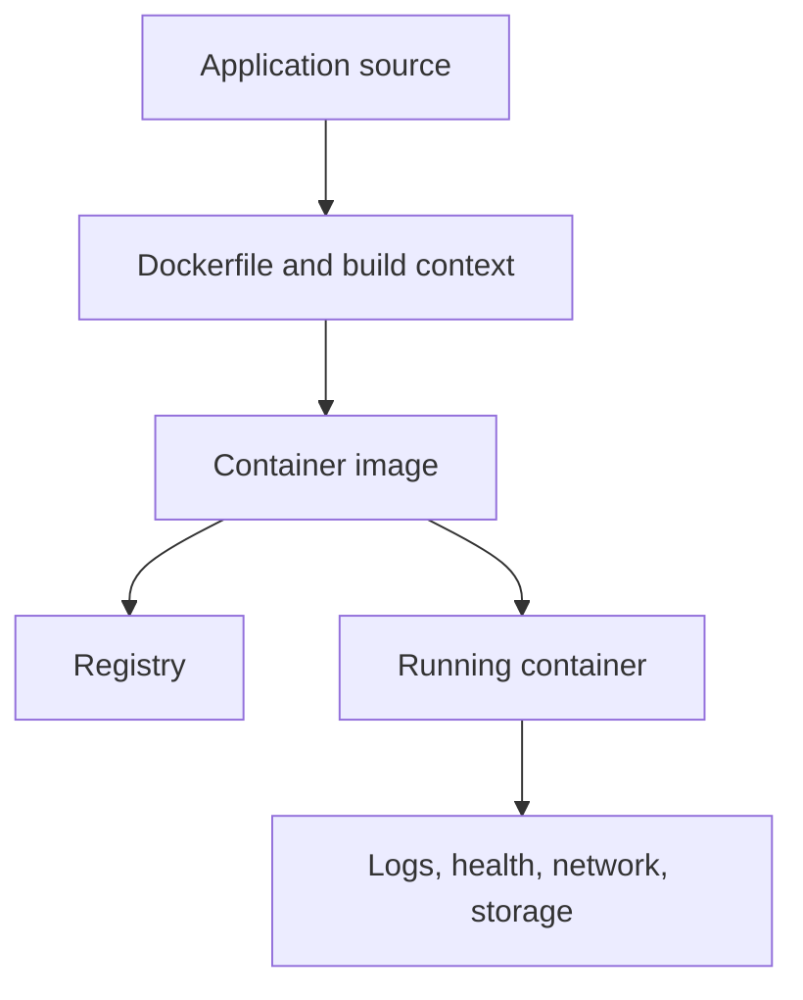

# Docker Interview Preparation

This package develops the Docker architecture, image-building, container operations, networking, storage, security, optimization, Compose, registry, and troubleshooting skills required for Linux System Administrator, DevOps, Cloud, Platform Engineering, and SRE interviews.

Docker packages an application and its runtime dependencies into an image, then runs that image as an isolated process called a container. Interview readiness requires understanding both developer workflows and the Linux mechanisms underneath them.

---

## Package Objectives

After completing this package, I should be able to:

- Explain Docker client, daemon, registry, image, container, and runtime relationships.
- Compare containers with virtual machines.
- Explain namespaces, cgroups, capabilities, and layered filesystems.
- Build secure, reproducible images with effective Dockerfiles.
- Explain build context, `.dockerignore`, cache, layers, tags, and digests.
- Manage container processes, logs, environment, resources, and health checks.
- Compare bind mounts, named volumes, and tmpfs mounts.
- Explain bridge, host, none, overlay, and macvlan networking concepts.
- Use Docker Compose for multi-container applications.
- Apply least privilege, non-root execution, secret protection, and image scanning concepts.
- Diagnose build, startup, connectivity, storage, health, and performance failures.
- Present a Docker project clearly in technical interviews.

---

## Container Workflow



---

## Package Structure

```text
04-Docker/
├── README.md
├── Study-Notes/
│   ├── 01-Docker-Fundamentals.md
│   └── 02-Advanced-Docker.md
├── Projects/
│   └── dockerized-health-web/
│       ├── README.md
│       ├── Dockerfile
│       ├── compose.yaml
│       ├── nginx.conf
│       ├── .dockerignore
│       └── html/index.html
├── Hands-on-Labs/
│   └── Docker-Hands-on-Labs.md
├── Troubleshooting-Scenarios/
│   └── Docker-Troubleshooting-Scenarios.md
├── Interview-Questions/
│   └── Docker-Interview-Questions-and-Answers.md
├── MCQ-Quizzes/
│   └── Docker-Interview-MCQ-Quiz.html
├── Cheat-Sheets/
│   └── Docker-Interview-Cheat-Sheet.md
└── Mock-Interview/
    └── Docker-Mock-Interview.md
```

---

## Study Modules

### Module 1 — Docker Fundamentals

- Architecture and runtime workflow
- Images, containers, layers, tags, and registries
- Essential commands and container lifecycle
- Dockerfile instructions and build context
- Port publishing, bridge networks, volumes, and logs
- Environment variables and health checks

[Open Docker Fundamentals](Study-Notes/01-Docker-Fundamentals.md)

### Module 2 — Advanced Docker

- Multi-stage builds and cache optimization
- BuildKit concepts and reproducibility
- Resource limits, restart behavior, signals, and PID 1
- User-defined networking and DNS
- Storage lifecycle and backup concepts
- Compose dependency and health design
- Rootless mode, capabilities, seccomp, AppArmor/SELinux, and scanning
- Registry authentication, tags, digests, and supply-chain considerations

[Open Advanced Docker](Study-Notes/02-Advanced-Docker.md)

---

## Required Project

The package includes a containerized static health website with:

- Custom Nginx configuration
- Non-root runtime
- Read-only container filesystem through Compose
- Health endpoint and Docker health check
- Port publishing
- Restart policy
- User-defined network
- `.dockerignore`
- Build, test, troubleshooting, and cleanup instructions

[Open Dockerized Health Web Project](Projects/dockerized-health-web/README.md)

---

## Core Interview Domains

| Domain | Required knowledge |
|---|---|
| Architecture | CLI, daemon, API, containerd, OCI/runtime concepts, registry |
| Isolation | Namespaces, cgroups, capabilities, seccomp, filesystem layers |
| Images | Layers, cache, tags, digests, manifests, registries |
| Dockerfiles | FROM, RUN, COPY, WORKDIR, USER, EXPOSE, CMD, ENTRYPOINT |
| Lifecycle | create, start, run, stop, kill, restart, remove, inspect |
| Storage | Writable layer, bind mount, volume, tmpfs, backup/lifecycle |
| Networking | Bridge, host, none, user-defined DNS, publishing, overlay concepts |
| Operations | Logs, exec, inspect, stats, events, health checks, signals |
| Compose | Services, networks, volumes, environment, health, dependencies |
| Security | Non-root, capabilities, secrets, scanning, trusted images, least privilege |
| Optimization | Multi-stage, small context, cache order, minimal base, pinned dependencies |
| Troubleshooting | Build, exit, health, network, storage, permissions, resources |

---

## Required Hands-on Labs

1. Docker environment and architecture inspection
2. Image pull, inspect, tag, and digest review
3. Container lifecycle and process behavior
4. Dockerfile and build-cache experiment
5. Environment, commands, logs, and exit status
6. Port publishing and bind-address testing
7. User-defined bridge networking and DNS
8. Bind mounts, named volumes, and tmpfs
9. Resource limits and container statistics
10. Health checks and restart behavior
11. Docker Compose application
12. Secure optimized image and failure-injection project

---

## Required Troubleshooting Scenarios

- Docker daemon is unavailable or permission is denied
- Image build cannot find a file in context
- Build cache returns unexpected content
- Container exits immediately
- Application runs but port is unreachable
- Service binds only to container loopback
- Containers cannot resolve each other
- Data disappears after container replacement
- Bind-mounted file permissions fail
- Container is unhealthy despite running
- OOMKilled or CPU throttling occurs
- Disk usage grows from images, layers, volumes, or logs
- Entrypoint and command arguments behave unexpectedly
- Registry pull returns authentication or platform errors
- Compose service starts before dependency is ready

---

## Two-Week Docker Plan

### Week 1 — Foundations

| Day | Focus | Deliverable |
|---:|---|---|
| 1 | Architecture, images, containers, and lifecycle | Architecture explanation |
| 2 | Dockerfiles, context, layers, and cache | Custom image |
| 3 | Processes, logs, environment, and health | Operations lab |
| 4 | Ports, networking, and DNS | Network lab |
| 5 | Volumes and bind mounts | Persistence lab |
| 6 | Commands and troubleshooting | Evidence report |
| 7 | Assessment | Foundation quiz |

### Week 2 — Production Docker

| Day | Focus | Deliverable |
|---:|---|---|
| 1 | Multi-stage builds and optimization | Optimized image |
| 2 | Resource controls, signals, and restart | Reliability lab |
| 3 | Compose design | Multi-service stack |
| 4 | Security and supply chain | Security review |
| 5 | Project and failure injection | Incident report |
| 6 | Interview scenarios | Mock technical round |
| 7 | Final review | Docker readiness assessment |

---

## Package Deliverables

| Deliverable | File |
|---|---|
| Docker foundation notes | [01-Docker-Fundamentals.md](Study-Notes/01-Docker-Fundamentals.md) |
| Advanced Docker notes | [02-Advanced-Docker.md](Study-Notes/02-Advanced-Docker.md) |
| Containerized project | [dockerized-health-web](Projects/dockerized-health-web/README.md) |
| Twelve hands-on labs | [Docker-Hands-on-Labs.md](Hands-on-Labs/Docker-Hands-on-Labs.md) |
| Fifteen troubleshooting scenarios | [Docker-Troubleshooting-Scenarios.md](Troubleshooting-Scenarios/Docker-Troubleshooting-Scenarios.md) |
| Forty interview questions and answers | [Docker-Interview-Questions-and-Answers.md](Interview-Questions/Docker-Interview-Questions-and-Answers.md) |
| Docker cheat sheet | [Docker-Interview-Cheat-Sheet.md](Cheat-Sheets/Docker-Interview-Cheat-Sheet.md) |
| Interactive 25-question quiz | [Docker-Interview-MCQ-Quiz.html](MCQ-Quizzes/Docker-Interview-MCQ-Quiz.html) |
| Sixty-minute mock interview | [Docker-Mock-Interview.md](Mock-Interview/Docker-Mock-Interview.md) |

---

## Progress Tracker

| Deliverable | Status |
|---|---|
| Package README | Complete |
| Foundation notes | Complete |
| Advanced notes | Complete |
| Containerized project | Complete |
| Hands-on labs | Complete |
| Troubleshooting scenarios | Complete |
| Interview questions | Complete |
| Cheat sheet | Complete |
| Interactive quiz | Complete |
| Mock interview | Complete |
| Final assessment | Ready to Attempt |

---

## Interview-Ready Checklist

- [ ] I can explain Docker architecture and Linux isolation.
- [ ] I can distinguish image, container, layer, tag, and digest.
- [ ] I can write and review a production-minded Dockerfile.
- [ ] I can explain CMD versus ENTRYPOINT.
- [ ] I can diagnose container process and signal behavior.
- [ ] I can choose among volumes, bind mounts, and tmpfs.
- [ ] I can troubleshoot publishing, DNS, and container networking.
- [ ] I can use Compose for repeatable multi-container environments.
- [ ] I can apply non-root and least-privilege practices.
- [ ] I can analyze health, resource, log, and disk problems.
- [ ] I can explain the included project in two and ten minutes.
- [ ] I can complete the timed mock interview confidently.

---

## Author

**Muhammad Khalid Khan**  
Linux System Administrator | DevOps | AWS | Automation  
GitHub: [krmaryum](https://github.com/krmaryum)

