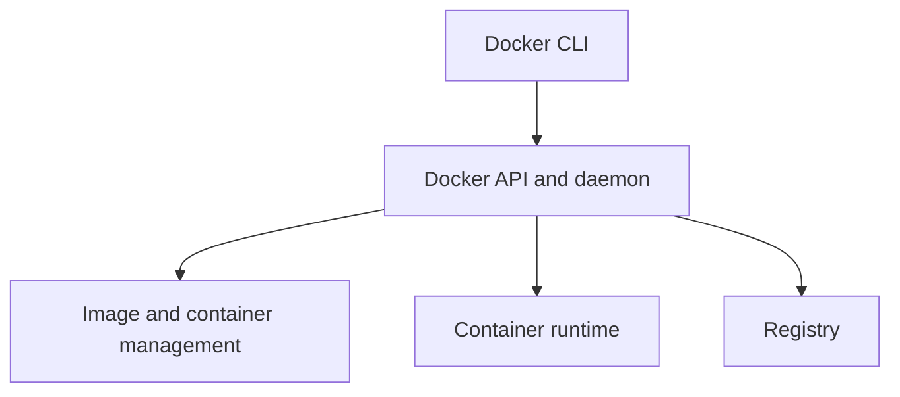

# Docker Fundamentals

**Package:** 04 — Docker Interview Preparation  
**Level:** Foundation to Intermediate

---

## 1. What Is Docker?

Docker is a platform for building, distributing, and running applications in containers. A container is an isolated process that shares the host kernel while receiving its own filesystem view, network context, process namespace, and resource controls.

### Why containers are useful

- Consistent application packaging
- Fast startup and replacement
- Portable deployment workflow
- Dependency isolation
- Efficient CI/CD artifacts
- Repeatable local and production environments

### Container versus virtual machine

| Area | Container | Virtual machine |
|---|---|---|
| Kernel | Shares host kernel | Has guest kernel |
| Isolation | Process-level mechanisms | Hypervisor/hardware virtualization |
| Startup | Usually fast | Usually slower |
| Image size | Commonly smaller | Commonly larger |
| Workload | Packaged process/application | Full guest operating system |

Containers are not simply “lightweight VMs”; their isolation and security boundaries differ.

---

## 2. Docker Architecture



### Components

- **Docker client:** sends API requests.
- **Docker daemon:** manages builds, images, containers, networks, and volumes.
- **Registry:** stores and distributes images.
- **containerd/runtime concepts:** manage container lifecycle and low-level execution.
- **OCI standards:** define image and runtime specifications used across container ecosystems.

```bash
docker version
docker info
docker context ls
```

---

## 3. Linux Container Foundations

### Namespaces

Namespaces isolate views of resources such as:

- Processes/PIDs
- Mounts/filesystems
- Network interfaces and routes
- Hostname
- Users
- IPC

### Cgroups

Control groups account for and limit CPU, memory, process count, and other resources.

### Capabilities

Linux capabilities divide root privileges into narrower units. Containers should receive only capabilities they need.

### Layered filesystem

Image layers are read-only. A running container receives a writable layer. Deleting the container removes that writable layer unless data is stored externally.

---

## 4. Images and Containers

### Image

An immutable package containing application files, runtime dependencies, metadata, and default configuration.

### Container

A running or stopped instance created from an image with runtime configuration and a writable layer.

```bash
docker image ls
docker pull nginx:alpine
docker image inspect nginx:alpine
docker run --name web nginx:alpine
docker container ls -a
```

### Tag versus digest

- A **tag** is a mutable human-readable reference such as `app:1.2`.
- A **digest** identifies immutable image content.
- Production workflows often pin trusted versions/digests and record provenance.

### Registry reference

```text
registry.example.com/team/application:1.2.0
```

---

## 5. Container Lifecycle

```text
create → start → running → stop/exit → remove
```

```bash
docker create --name demo nginx:alpine
docker start demo
docker stop demo
docker restart demo
docker rm demo
```

`docker run` combines create and start.

### Foreground and detached

```bash
docker run --rm nginx:alpine
docker run -d --name web nginx:alpine
```

### Inspect and logs

```bash
docker inspect web
docker logs web
docker logs -f --tail 100 web
docker top web
docker stats web
```

### Execute versus attach

```bash
docker exec -it web sh
docker attach web
```

`exec` starts another process. `attach` connects to the container's main process streams and can affect it depending on input/signals.

---

## 6. Main Process and Exit Behavior

A container normally stays running while its main process (PID 1 inside the container) runs. If that process exits, the container stops.

Common immediate-exit causes:

- Command completes normally
- Application crashes
- Configuration or dependency missing
- Permission failure
- Incorrect ENTRYPOINT/CMD
- Host architecture mismatch

```bash
docker ps -a
docker inspect --format '{{.State.ExitCode}} {{.State.Error}}' container
docker logs container
```

---

## 7. Dockerfile Fundamentals

Example:

```dockerfile
FROM nginx:alpine
COPY html/ /usr/share/nginx/html/
EXPOSE 80
```

Build:

```bash
docker build -t interview-web:1.0 .
```

### Important instructions

| Instruction | Purpose |
|---|---|
| `FROM` | Base image/stage |
| `RUN` | Execute during build; creates a layer |
| `COPY` | Copy from build context/stage |
| `ADD` | Copy plus special archive/URL behavior; use intentionally |
| `WORKDIR` | Set working directory |
| `ENV` | Set image environment variable |
| `ARG` | Build-time variable; not a secret mechanism |
| `USER` | Set runtime/build user for following instructions |
| `EXPOSE` | Document intended container port |
| `HEALTHCHECK` | Define container health probe |
| `ENTRYPOINT` | Configure executable |
| `CMD` | Default command or arguments |

### Build context

The final argument to `docker build` supplies the context. `COPY` can only access permitted context files, not arbitrary parent paths.

### `.dockerignore`

Exclude unnecessary or sensitive files:

```text
.git
.env
*.log
tmp/
```

Never rely on `.dockerignore` as the only secret-control mechanism; keep secrets out of source and build inputs.

---

## 8. CMD and ENTRYPOINT

Exec form is preferred for predictable signal/argument behavior:

```dockerfile
ENTRYPOINT ["/usr/local/bin/app"]
CMD ["--port", "8080"]
```

- ENTRYPOINT defines the primary executable.
- CMD supplies default command/arguments and can be overridden.
- Shell form runs through a shell and can alter signal handling and variable expansion.

```bash
docker run image --port 9090
```

---

## 9. Port Publishing

`EXPOSE` documents a container port; it does not publish it to the host.

```bash
docker run -d --name web -p 8080:80 nginx:alpine
```

```text
host port 8080 → container port 80
```

Bind host loopback only:

```bash
docker run -d -p 127.0.0.1:8080:80 nginx:alpine
```

Inspect:

```bash
docker port web
ss -lntp
curl http://127.0.0.1:8080
```

The application inside the container must listen on an appropriate container interface, not only its own `127.0.0.1`, for published traffic to reach it.

---

## 10. Docker Networking

### Default bridge

Containers receive private addresses and outbound NAT. Name resolution behavior is more limited than on user-defined networks.

### User-defined bridge

Provides better isolation and automatic DNS-based container-name/service discovery.

```bash
docker network create app-network
docker run -d --name api --network app-network image
docker run --rm --network app-network busybox nslookup api
```

### Other drivers/concepts

| Network | Concept |
|---|---|
| `bridge` | Local-host container network |
| `host` | Shares host network namespace on supported platforms |
| `none` | No normal network connectivity |
| `overlay` | Multi-host networking in orchestration contexts |
| `macvlan` | Container appears with a MAC on external network |

---

## 11. Storage

### Writable layer

Temporary container-local changes; removed with container deletion.

### Named volume

Managed by Docker and independent of a specific container.

```bash
docker volume create app-data
docker run -v app-data:/var/lib/app image
```

### Bind mount

Maps a specific host path.

```bash
docker run --mount type=bind,src="$PWD/config",dst=/app/config,readonly image
```

### tmpfs

Stores ephemeral data in memory rather than persistent storage.

### Comparison

| Type | Lifecycle | Main use |
|---|---|---|
| Writable layer | Container | Ephemeral runtime changes |
| Named volume | Independent | Persistent application data |
| Bind mount | Host path | Configuration/source/integration |
| tmpfs | Memory/container runtime | Sensitive or temporary data |

---

## 12. Environment and Secrets

```bash
docker run -e APP_ENV=production image
docker run --env-file app.env image
```

Environment variables are visible through container inspection and process/application behavior. They are not automatically a secure secret store. Use the platform's approved secret mechanism and avoid embedding secrets in images, Dockerfiles, build arguments, layers, or logs.

---

## 13. Health Checks

```dockerfile
HEALTHCHECK --interval=30s --timeout=3s --retries=3 \
  CMD wget -qO- http://127.0.0.1:8080/health || exit 1
```

Health status does not automatically restart a normal Docker container. Orchestration/restart behavior must be designed separately.

```bash
docker inspect --format '{{json .State.Health}}' container
```

---

## 14. Docker Compose Fundamentals

Compose defines services, networks, volumes, configuration, and runtime options in YAML.

```yaml
services:
  web:
    image: nginx:alpine
    ports:
      - "8080:80"
```

```bash
docker compose config
docker compose up -d
docker compose ps
docker compose logs -f
docker compose down
```

`depends_on` controls startup ordering; readiness requires health conditions or application-level retry behavior.

---

## 15. Foundation Checklist

- [ ] I can explain Docker architecture and container isolation.
- [ ] I can compare images, containers, tags, and digests.
- [ ] I can manage container lifecycle and inspect exit behavior.
- [ ] I understand Dockerfile instructions and build context.
- [ ] I can explain CMD and ENTRYPOINT.
- [ ] I can publish and troubleshoot a container port.
- [ ] I understand user-defined bridge DNS.
- [ ] I can choose storage types correctly.
- [ ] I understand environment and secret risks.
- [ ] I can use health checks and Compose fundamentals.

