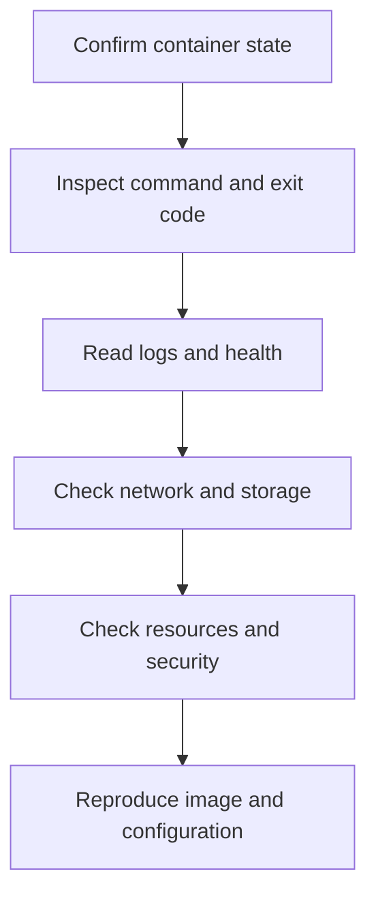

# Advanced Docker

**Package:** 04 — Docker Interview Preparation  
**Level:** Intermediate to Advanced

---

## 1. Image Layers and Cache

Each filesystem-changing Dockerfile instruction creates a layer. Cache reuse depends on instruction and input metadata/content.

Optimization pattern:

```dockerfile
FROM python:3-slim
WORKDIR /app
COPY requirements.txt .
RUN pip install --no-cache-dir -r requirements.txt
COPY . .
CMD ["python", "app.py"]
```

Dependency installation is placed before frequently changing source so cache survives source edits.

### Cache invalidation

- Changed instruction
- Changed copied files
- Changed build arguments affecting steps
- Explicit no-cache build
- Different base image resolution

```bash
docker build --no-cache -t app:test .
docker history app:test
```

Deleting a file in a later layer does not remove it from earlier image history. Never copy secrets into a layer.

---

## 2. Multi-Stage Builds

Multi-stage builds separate build dependencies from the runtime image.

```dockerfile
FROM golang:alpine AS build
WORKDIR /src
COPY . .
RUN go build -o /out/app ./cmd/app

FROM alpine
COPY --from=build /out/app /usr/local/bin/app
USER 10001
ENTRYPOINT ["/usr/local/bin/app"]
```

Benefits:

- Smaller runtime image
- Reduced attack surface
- Build tools excluded
- Cleaner artifact boundary

---

## 3. Reproducibility and Supply Chain

Production considerations:

- Use trusted minimal base images.
- Pin versions and, where required, immutable digests.
- Rebuild regularly for patched dependencies.
- Generate and store provenance/SBOM information where supported.
- Scan image packages and configuration.
- Sign/verify images where organizational policy requires.
- Restrict registry write permissions.

A digest ensures content identity but does not prove that content is secure or trusted.

---

## 4. PID 1 and Signals

The container's main process is PID 1 inside its PID namespace and has special signal/child-reaping responsibilities.

Problems arise when:

- Shell wrapper does not forward signals
- Application does not handle SIGTERM
- Zombie child processes are not reaped
- Stop grace period is too short

Prefer exec form and `exec` from wrapper scripts:

```bash
#!/usr/bin/env sh
set -e
prepare_configuration
exec "$@"
```

```bash
docker stop --time 20 container
docker kill --signal HUP container
```

---

## 5. Resource Controls

```bash
docker run \
  --memory 512m \
  --cpus 1.5 \
  --pids-limit 200 \
  image
```

```bash
docker stats
docker inspect container
```

### OOM behavior

If a container exceeds its effective memory limit, the kernel can kill a process. Inspect:

```bash
docker inspect --format '{{.State.OOMKilled}} {{.State.ExitCode}}' container
journalctl -k | grep -i oom
```

Limits require monitoring and workload-specific sizing; extremely low limits create instability.

---

## 6. Restart Policies

```bash
docker run --restart unless-stopped image
```

| Policy | Behavior concept |
|---|---|
| `no` | No automatic restart |
| `on-failure` | Restart after nonzero exit, optionally limited |
| `always` | Restart regardless of exit/daemon restart behavior |
| `unless-stopped` | Restart unless explicitly stopped |

Restart policies can create crash loops. Always inspect logs and exit cause rather than using restarts as the root-cause fix.

---

## 7. Advanced Networking

### Container-to-container

Use a user-defined network and service/container DNS name. Do not use host-published ports for internal traffic when direct container networking is intended.

### Host-to-container

Port publishing configures host reachability. Bind to `127.0.0.1` when only local access is intended.

### Container-to-host

Behavior differs by operating system and Docker environment. Avoid assuming `localhost` inside a container means the host; it means that container's loopback.

### DNS troubleshooting

```bash
docker network inspect network
docker exec container cat /etc/resolv.conf
docker exec container getent hosts service
```

---

## 8. Storage Operations

### Identify mounts

```bash
docker inspect --format '{{json .Mounts}}' container
docker volume inspect volume
```

### Backup concept

Application-consistent backup can require quiescing writes or using database-native tooling. Copying a live volume is not automatically consistent.

### Ownership

Bind mounts preserve host filesystem ownership/permissions. Container UID/GID must align with intended access. Avoid solving permission issues with `chmod 777`.

### Volume removal

`docker compose down` does not remove named volumes unless `-v` is requested. Confirm data retention before removal.

---

## 9. Logging

Containers should normally write application logs to stdout/stderr, allowing the runtime logging driver/platform to collect them.

```bash
docker logs --since 10m container
docker info --format '{{.LoggingDriver}}'
```

Unbounded container logs can consume host disk. Configure driver rotation or centralized logging according to platform design.

Avoid logging secrets and sensitive request content.

---

## 10. Compose Production Concepts

Compose features:

- Services
- User-defined networks
- Named volumes
- Environment/configuration
- Health checks
- Dependencies
- Resource and security settings

```yaml
services:
  app:
    build: .
    healthcheck:
      test: ["CMD", "wget", "-qO-", "http://127.0.0.1:8080/health"]
      interval: 10s
      timeout: 3s
      retries: 3
```

Application retry logic remains important because dependencies can become unavailable after startup.

---

## 11. Security Hardening

### Non-root

```dockerfile
RUN addgroup --system app && adduser --system --ingroup app app
USER app
```

### Runtime controls

```bash
docker run \
  --read-only \
  --tmpfs /tmp \
  --cap-drop ALL \
  --security-opt no-new-privileges:true \
  image
```

Add back only required capabilities and writable paths.

### Avoid

- `--privileged` without strong justification
- Docker socket mounts into untrusted containers
- Root user by default
- Secrets in image layers/environment/logs
- Untrusted images
- Broad host bind mounts
- Disabling default security profiles casually

Mounting `/var/run/docker.sock` commonly grants control equivalent to the Docker daemon and therefore high host privilege.

---

## 12. Rootless Docker

Rootless mode runs daemon and containers without a root-owned daemon, reducing some host risks. It has platform, networking, storage, and privileged-port limitations that must be evaluated.

Rootless mode improves defense but does not make untrusted containers automatically safe.

---

## 13. Image and Host Cleanup

Inspect before cleanup:

```bash
docker system df
docker image ls
docker container ls -a
docker volume ls
docker builder prune --filter until=24h
```

Prune commands can remove recoverable build cache and unused objects. Volumes may contain important data. Resolve exact targets and retention requirements before cleanup.

---

## 14. Troubleshooting Workflow



### Evidence commands

```bash
docker ps -a
docker inspect container
docker logs --tail 100 container
docker events --since 10m
docker stats --no-stream
docker network inspect network
docker volume inspect volume
docker system df
```

---

## 15. Advanced Checklist

- [ ] I can optimize cache without hiding dependency changes.
- [ ] I can explain multi-stage build benefits.
- [ ] I understand tags, digests, scanning, and provenance concepts.
- [ ] I can explain PID 1 and signal forwarding.
- [ ] I can diagnose OOMKilled and resource throttling.
- [ ] I can select restart policies intentionally.
- [ ] I can troubleshoot container DNS and routing.
- [ ] I understand volume ownership and consistent backup.
- [ ] I can control container log growth.
- [ ] I can apply non-root, capabilities, read-only, and no-new-privileges controls.
- [ ] I understand Docker socket and privileged-container risk.
- [ ] I can use an evidence-based Docker troubleshooting workflow.

