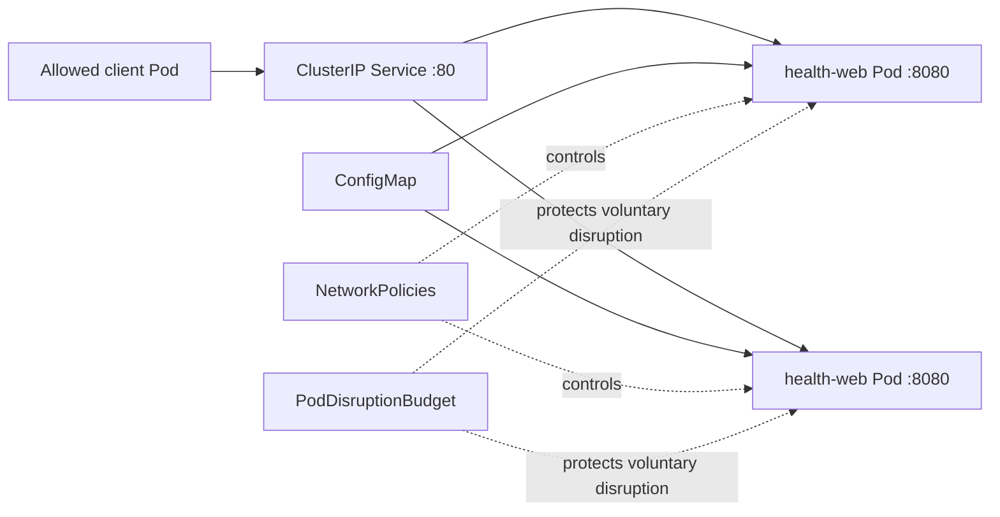

# Production-Ready Kubernetes Web Application

This project deploys a small Nginx health website while demonstrating production-minded Kubernetes controls. It is intentionally simple at the application layer so the interview discussion can focus on orchestration behavior.

## Architecture



## Files

| File | Purpose |
|---|---|
| `namespace.yaml` | Dedicated namespace with Restricted Pod Security enforcement labels |
| `configmap.yaml` | Nginx configuration and static page |
| `deployment.yaml` | Replicas, rolling update, resources, probes, security, lifecycle |
| `service.yaml` | Stable internal ClusterIP and named target port |
| `networkpolicy.yaml` | Default deny plus explicit application access and DNS egress |
| `pdb.yaml` | Keeps one replica available during supported voluntary disruption |
| `kustomization.yaml` | Applies all resources as one reviewed unit |

## Security and Reliability Controls

- Runs as numeric non-root UID/GID 101.
- Disables privilege escalation and drops all Linux capabilities.
- Uses the runtime-default seccomp profile.
- Uses a read-only root filesystem with a size-limited `emptyDir` for `/tmp`.
- Does not mount a ServiceAccount token.
- Enforces startup, readiness, and liveness checks.
- Defines CPU/memory requests and limits.
- Uses two replicas, zero-unavailable rolling updates, and a PDB.
- Limits ingress to explicitly labeled client Pods.
- Uses a dedicated namespace with Pod Security Admission labels.

> For a real production release, pin the image by verified digest and integrate image scanning/signature policy. The version tag here keeps the learning manifest readable.

## Prerequisites

- A disposable Kubernetes cluster
- `kubectl` configured for that cluster
- Kustomize support through `kubectl -k`
- A CNI plugin that enforces NetworkPolicy for policy testing

Always confirm the context before applying:

```bash
kubectl config current-context
kubectl cluster-info
```

## Validate Before Deployment

```bash
kubectl kustomize .
kubectl apply --dry-run=client -k .
kubectl diff -k .
```

Server-side dry-run requires a reachable cluster:

```bash
kubectl apply --dry-run=server -k .
```

## Deploy and Observe

```bash
kubectl apply -k .
kubectl rollout status deployment/health-web -n interview-k8s
kubectl get deploy,rs,pods,svc,endpointslice,pdb,networkpolicy -n interview-k8s
kubectl describe deployment health-web -n interview-k8s
```

## Access from the Workstation

Port-forwarding is useful for this local interview lab:

```bash
kubectl port-forward -n interview-k8s service/health-web 8080:80
curl -fsS http://127.0.0.1:8080/
curl -fsS http://127.0.0.1:8080/healthz
```

Port-forwarding is not a production ingress design.

## Verify NetworkPolicy

An unlabeled client should be denied when the CNI enforces policy:

```bash
kubectl run denied-client -n interview-k8s --rm -it --restart=Never \
  --image=curlimages/curl -- curl --max-time 3 http://health-web
```

An explicitly labeled client should be allowed:

```bash
kubectl run allowed-client -n interview-k8s --rm -it --restart=Never \
  --labels=access=health-web --image=curlimages/curl -- \
  curl -fsS http://health-web/healthz
```

## Practice Rollout and Rollback

```bash
kubectl set image deployment/health-web web=nginx:does-not-exist -n interview-k8s
kubectl rollout status deployment/health-web -n interview-k8s --timeout=60s
kubectl get pods -n interview-k8s
kubectl describe pod -n interview-k8s -l app.kubernetes.io/name=health-web
kubectl rollout undo deployment/health-web -n interview-k8s
kubectl rollout status deployment/health-web -n interview-k8s
```

This injects an image-pull failure while the rolling strategy should preserve available old replicas.

## Failure-Injection Exercises

1. Change the readiness path and observe endpoints.
2. Raise memory requests beyond node capacity and inspect Pending Events.
3. Break the Service selector and trace the empty EndpointSlice.
4. Remove the allowed NetworkPolicy and test client connectivity.
5. Attempt a node drain in a disposable cluster and observe the PDB.

For every failure, record symptom, scope, desired/observed state, Events, logs, root cause, correction, verification, and prevention.

## Cleanup

Review the target first:

```bash
kubectl get all -n interview-k8s
kubectl delete -k .
kubectl get namespace interview-k8s
```

Deleting the Namespace removes its namespaced resources. Use only against the disposable lab namespace and intended context.

## Two-Minute Interview Explanation

> I deployed a two-replica Nginx workload in a dedicated namespace. A ClusterIP Service selects Pods through stable labels. Startup, readiness, and liveness probes separate initialization, traffic eligibility, and deadlock recovery. Requests and limits support scheduling and resource isolation. The containers run non-root with no extra capabilities, a read-only root filesystem, runtime-default seccomp, and no API token. Default-deny NetworkPolicy restricts traffic, while a PDB and zero-unavailable rolling update improve planned-maintenance availability. I validate with Kustomize, observe rollout conditions and EndpointSlices, and inject image, probe, selector, resource, and policy failures to practice evidence-first troubleshooting.

---

**Author:** Muhammad Khalid Khan  
**Repository:** DevOps & SRE Interview Preparation
