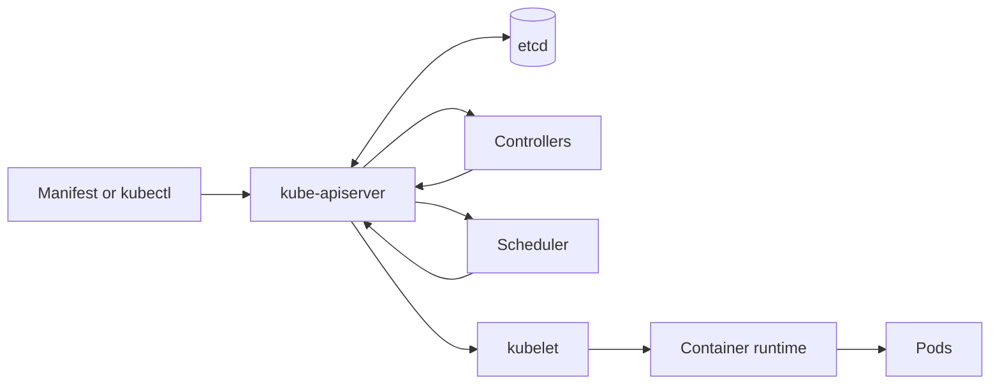

# Kubernetes Interview Preparation

This package develops the Kubernetes architecture, workload management, scheduling, networking, storage, configuration, security, reliability, observability, and troubleshooting skills required for DevOps, Cloud, Platform Engineering, and SRE interviews.

Kubernetes is a declarative orchestration system. Interview readiness means understanding not only YAML and `kubectl`, but also how desired state moves through the API server, etcd, controllers, scheduler, kubelet, container runtime, networking, and storage integrations.

---

## Package Objectives

After completing this package, I should be able to:

- Explain the control plane and worker-node architecture.
- Trace a Deployment from `kubectl apply` to running Pods.
- Compare Pod, ReplicaSet, Deployment, StatefulSet, DaemonSet, Job, and CronJob.
- Use labels, selectors, namespaces, annotations, owners, and finalizers correctly.
- Explain requests, limits, Quality of Service, scheduling, affinity, taints, and tolerations.
- Compare ClusterIP, NodePort, LoadBalancer, headless Service, Ingress, and Gateway concepts.
- Explain the Kubernetes network model, DNS, CNI, kube-proxy, and NetworkPolicy.
- Work with ConfigMaps, Secrets, ServiceAccounts, RBAC, and security contexts.
- Explain PV, PVC, StorageClass, access modes, reclaim policy, and CSI.
- Design liveness, readiness, and startup probes correctly.
- Perform rollouts, rollback, scaling, disruption management, and graceful termination.
- Diagnose Pending, CrashLoopBackOff, ImagePullBackOff, OOMKilled, probe, DNS, Service, storage, and authorization failures.
- Present a production-minded Kubernetes project in technical interviews.

---

## Reconciliation Workflow



---

## Package Structure

```text
05-Kubernetes/
├── README.md
├── Study-Notes/
│   ├── 01-Kubernetes-Fundamentals.md
│   └── 02-Advanced-Kubernetes.md
├── Projects/
│   └── production-ready-web-app/
│       ├── README.md
│       ├── namespace.yaml
│       ├── configmap.yaml
│       ├── deployment.yaml
│       ├── service.yaml
│       ├── networkpolicy.yaml
│       ├── pdb.yaml
│       └── kustomization.yaml
├── Hands-on-Labs/
│   └── Kubernetes-Hands-on-Labs.md
├── Troubleshooting-Scenarios/
│   └── Kubernetes-Troubleshooting-Scenarios.md
├── Interview-Questions/
│   └── Kubernetes-Interview-Questions-and-Answers.md
├── MCQ-Quizzes/
│   └── Kubernetes-Interview-MCQ-Quiz.html
├── Cheat-Sheets/
│   └── Kubernetes-Interview-Cheat-Sheet.md
└── Mock-Interview/
    └── Kubernetes-Mock-Interview.md
```

---

## Study Modules

### Module 1 — Kubernetes Fundamentals

- Cluster architecture and API workflow
- Pods, controllers, labels, selectors, and namespaces
- Declarative manifests and essential `kubectl`
- Services, DNS, configuration, Secrets, and probes
- Volumes, requests, limits, and basic scheduling

[Open Kubernetes Fundamentals](Study-Notes/01-Kubernetes-Fundamentals.md)

### Module 2 — Advanced Kubernetes

- StatefulSet, DaemonSet, Job, and CronJob design
- Scheduling, affinity, topology, taints, and disruption
- CNI, CSI, kube-proxy, NetworkPolicy, Ingress, and Gateway concepts
- RBAC, Pod Security Standards, admission, and supply-chain security
- Autoscaling, rollout strategy, observability, backup, and upgrades
- Production troubleshooting and cluster reliability

[Open Advanced Kubernetes](Study-Notes/02-Advanced-Kubernetes.md)

---

## Required Project

The package includes a production-minded web application deployment with:

- Dedicated namespace
- ConfigMap-based Nginx content
- Deployment with rolling-update strategy
- Non-root security context and dropped capabilities
- Read-only root filesystem
- Requests, limits, startup, readiness, and liveness probes
- Graceful termination lifecycle
- Internal ClusterIP Service
- Default-deny and explicitly allowed NetworkPolicies
- PodDisruptionBudget
- Kustomize deployment workflow

[Open Production-Ready Web App Project](Projects/production-ready-web-app/README.md)

---

## Core Interview Domains

| Domain | Required knowledge |
|---|---|
| Architecture | API server, etcd, scheduler, controllers, kubelet, runtime, kube-proxy |
| API objects | spec/status, metadata, labels, selectors, owner references, finalizers |
| Workloads | Pod, ReplicaSet, Deployment, StatefulSet, DaemonSet, Job, CronJob |
| Scheduling | Requests, filters/scores, affinity, topology, taints, tolerations, priority |
| Networking | Pod network, CNI, Service, DNS, kube-proxy, NetworkPolicy, ingress |
| Storage | PV, PVC, StorageClass, CSI, access modes, reclaim, snapshots |
| Configuration | ConfigMap, Secret, environment, volumes, projected data |
| Reliability | Probes, rollouts, PDB, graceful shutdown, replicas, anti-affinity |
| Scaling | HPA, VPA concepts, cluster/node autoscaling, metrics |
| Security | Authentication, authorization, admission, RBAC, ServiceAccount, PSS |
| Observability | Events, logs, metrics, audit, traces, control-plane and workload signals |
| Troubleshooting | Pending, crash loops, pulls, probes, DNS, networking, storage, RBAC |

---

## Required Hands-on Labs

1. Cluster context, API resources, and architecture inspection
2. Declarative Pod and `kubectl` observation
3. Labels, selectors, annotations, and namespaces
4. Deployment rollout, history, scaling, and rollback
5. ConfigMaps, Secrets, and projected configuration
6. Startup, readiness, and liveness probes
7. Services, endpoints, DNS, and port-forwarding
8. NetworkPolicy isolation and verification
9. Requests, limits, scheduling, and Quality of Service
10. Volumes, PVCs, and storage lifecycle
11. Jobs, CronJobs, DaemonSets, and StatefulSets
12. Production project, failure injection, and incident report

---

## Required Troubleshooting Scenarios

- Wrong cluster context or expired credentials
- Pod remains Pending
- ImagePullBackOff or ErrImagePull
- CrashLoopBackOff
- OOMKilled or CPU throttling
- Deployment rollout is stuck
- Readiness fails while application is running
- Liveness probe creates a restart loop
- Service has no endpoints
- Service DNS or network connection fails
- NetworkPolicy blocks required traffic
- PVC remains Pending or mount fails
- ConfigMap or Secret update is not reflected
- RBAC returns Forbidden
- Node becomes NotReady and workloads are disrupted

---

## Two-Week Kubernetes Plan

### Week 1 — Core Objects and Operations

| Day | Focus | Deliverable |
|---:|---|---|
| 1 | Architecture, API, Pods, and kubectl | Architecture explanation |
| 2 | Labels, selectors, namespaces, and controllers | Object relationship map |
| 3 | Deployments, rollout, scale, and rollback | Deployment lab |
| 4 | ConfigMaps, Secrets, and probes | Configured workload |
| 5 | Services, DNS, and networking | Service discovery lab |
| 6 | Storage, requests, and limits | Persistence/resource lab |
| 7 | Assessment | Foundation quiz |

### Week 2 — Production Kubernetes

| Day | Focus | Deliverable |
|---:|---|---|
| 1 | Scheduling, disruption, and autoscaling | Reliability design |
| 2 | Stateful and node-level workloads | Controller comparison |
| 3 | RBAC, admission, and workload security | Security review |
| 4 | Observability and systematic troubleshooting | Incident evidence report |
| 5 | Project and failure injection | Corrected deployment |
| 6 | Interview scenarios | Mock technical round |
| 7 | Final review | Kubernetes readiness assessment |

---

## Package Deliverables

| Deliverable | File |
|---|---|
| Foundation notes | [01-Kubernetes-Fundamentals.md](Study-Notes/01-Kubernetes-Fundamentals.md) |
| Advanced notes | [02-Advanced-Kubernetes.md](Study-Notes/02-Advanced-Kubernetes.md) |
| Kubernetes project | [production-ready-web-app](Projects/production-ready-web-app/README.md) |
| Twelve hands-on labs | [Kubernetes-Hands-on-Labs.md](Hands-on-Labs/Kubernetes-Hands-on-Labs.md) |
| Fifteen troubleshooting scenarios | [Kubernetes-Troubleshooting-Scenarios.md](Troubleshooting-Scenarios/Kubernetes-Troubleshooting-Scenarios.md) |
| Forty interview questions and answers | [Kubernetes-Interview-Questions-and-Answers.md](Interview-Questions/Kubernetes-Interview-Questions-and-Answers.md) |
| Kubernetes cheat sheet | [Kubernetes-Interview-Cheat-Sheet.md](Cheat-Sheets/Kubernetes-Interview-Cheat-Sheet.md) |
| Interactive 25-question quiz | [Kubernetes-Interview-MCQ-Quiz.html](MCQ-Quizzes/Kubernetes-Interview-MCQ-Quiz.html) |
| Sixty-minute mock interview | [Kubernetes-Mock-Interview.md](Mock-Interview/Kubernetes-Mock-Interview.md) |

---

## Progress Tracker

| Deliverable | Status |
|---|---|
| Package README | Complete |
| Foundation notes | Complete |
| Advanced notes | Complete |
| Kubernetes project | Complete |
| Hands-on labs | Complete |
| Troubleshooting scenarios | Complete |
| Interview questions | Complete |
| Cheat sheet | Complete |
| Interactive quiz | Complete |
| Mock interview | Complete |
| Final assessment | Ready to Attempt |

---

## Interview-Ready Checklist

- [ ] I can draw and explain Kubernetes architecture.
- [ ] I can trace reconciliation from desired state to running Pods.
- [ ] I can choose the correct workload controller.
- [ ] I can explain scheduling and resource management.
- [ ] I can troubleshoot Services, DNS, and NetworkPolicies.
- [ ] I can explain persistent storage and CSI concepts.
- [ ] I can design correct probes and graceful termination.
- [ ] I can apply ServiceAccount, RBAC, and workload security controls.
- [ ] I can investigate failures using status, events, logs, and metrics.
- [ ] I can explain the included project in two and ten minutes.
- [ ] I can complete the timed mock interview confidently.

---

## Official References

- [Kubernetes Components](https://kubernetes.io/docs/concepts/overview/components/)
- [Workloads](https://kubernetes.io/docs/concepts/workloads/)
- [Services, Load Balancing, and Networking](https://kubernetes.io/docs/concepts/services-networking/)
- [Storage](https://kubernetes.io/docs/concepts/storage/)
- [Security](https://kubernetes.io/docs/concepts/security/)

---

## Author

**Muhammad Khalid Khan**  
Linux System Administrator | DevOps | AWS | Automation  
GitHub: [krmaryum](https://github.com/krmaryum)
