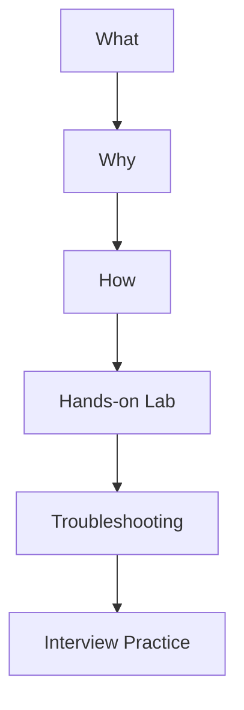

# DevOps & SRE Interview Preparation

A structured, hands-on repository for preparing for Linux System Administrator, DevOps Engineer, Cloud Engineer, Platform Engineer, and Site Reliability Engineer interviews.

The project combines technical study notes, practical labs, troubleshooting exercises, scenario-based questions, automation projects, architecture diagrams, quizzes, and mock interviews.

---

## Project Goal

The goal is not simply to memorize definitions. Each track is designed to develop the ability to:

- Explain **what** a technology is, **why** it is needed, and **how** it works.
- Perform realistic administration and engineering tasks.
- Troubleshoot failures using a structured isolation method.
- Compare alternative tools and architectural decisions.
- Answer technical and scenario-based interview questions.
- Present real projects confidently during an interview.

---

## Core Interview Tracks

| No. | Track | Primary Focus |
|---:|---|---|
| 1 | Linux | Administration, services, storage, security, and troubleshooting |
| 2 | Bash Scripting | Automation, validation, functions, error handling, and reusable scripts |
| 3 | Networking | TCP/IP, DNS, routing, firewalls, TLS, proxies, and advanced networking |
| 4 | Docker | Images, containers, storage, networking, Compose, and security |
| 5 | Kubernetes | Workloads, services, storage, RBAC, scaling, and troubleshooting |
| 6 | CI/CD | Automated testing, builds, security checks, deployment, and rollback |
| 7 | Terraform | Infrastructure as Code, state, modules, backends, and reusable design |
| 8 | Ansible | Configuration management, playbooks, roles, Vault, and idempotency |
| 9 | AWS Cloud Services | IAM, networking, compute, storage, databases, monitoring, and reliability |
| 10 | Python for DevOps | Automation, files, APIs, error handling, and operational tools |
| 11 | Observability | Metrics, logs, traces, alerting, SLOs, and incident response |

Supporting topics include Git and GitHub, Nginx, reverse proxies, security, system design, root-cause analysis, and behavioral interview preparation.

---

## Learning Method

Every major topic follows this interview-focused workflow:



Each track can contain:

- Study notes
- Cheat sheets
- Architecture diagrams
- Hands-on labs
- Troubleshooting scenarios
- Interview questions
- Interactive MCQ quizzes
- Mini projects
- Revision checklists

---

## Repository Structure

```text
DevOps-SRE-Interview-Preparation/
|-- README.md
|-- 00-Master-Roadmap/
|-- 01-Linux/
|-- 02-Bash-Scripting/
|-- 03-Networking/
|-- 04-Docker/
|-- 05-Kubernetes/
|-- 06-CI-CD/
|-- 07-Terraform/
|-- 08-Ansible/
|-- 09-AWS-Cloud-Services/
|-- 10-Python-for-DevOps/
|-- 11-Observability/
|-- 12-System-Design/
|-- 13-Mock-Interviews/
`-- 14-Capstone-Project/
```

See the [Master Roadmap](00-Master-Roadmap/Master-Roadmap.md) for the complete learning sequence, required outcomes, weekly plan, capstone project, and progress tracker.

---

## Weekly Practice Pattern

| Day | Activity |
|---:|---|
| 1 | Learn concepts through What -> Why -> How |
| 2 | Practice commands, configuration, and architecture |
| 3 | Complete a guided hands-on lab |
| 4 | Diagnose injected failures and troubleshooting scenarios |
| 5 | Complete MCQs and short technical questions |
| 6 | Practice scenario and system-design questions |
| 7 | Complete a timed mock interview and weekly revision |

---

## Capstone Project

The final capstone is a production-style cloud application platform that brings the core tracks together:

- Terraform provisions AWS infrastructure.
- Ansible configures Linux systems.
- Bash and Python automate operational tasks.
- Docker packages the application.
- Kubernetes runs and scales the workloads.
- CI/CD tests and deploys changes.
- Networking provides DNS, TLS, ingress, and load balancing.
- Observability collects metrics, logs, traces, and alerts.

The project will also document security, reliability, cost, failure recovery, and architectural decisions.

---

## Interview-Ready Definition

A track is considered interview-ready when I can:

- Explain the architecture without reading notes.
- Complete the required lab independently.
- Troubleshoot common failures systematically.
- Answer beginner, intermediate, advanced, and scenario questions.
- Describe a relevant project in two-minute and ten-minute formats.
- Explain security, reliability, monitoring, and cost considerations.

---

## Project Status

| Package | Track | Status |
|---:|---|---|
| 00 | Repository Foundation | Complete |
| 01 | [Linux Interview Preparation](01-Linux/README.md) | Complete |
| 02 | [Bash Scripting Interview Preparation](02-Bash-Scripting/README.md) | Complete |
| 03 | Networking and Advanced Networking | Next |

The repository is under active development. Each package is completed, validated, and committed before work begins on the next package.

---

## Author

**Muhammad Khalid Khan**  
Linux System Administrator | DevOps | AWS | Automation  
GitHub: [krmaryum](https://github.com/krmaryum)

---

## Disclaimer

The labs are intended for learning and interview preparation. Administrative commands, cloud resources, security changes, and cleanup operations should be tested in a disposable lab environment before being used on production systems.
